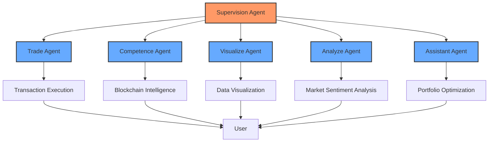
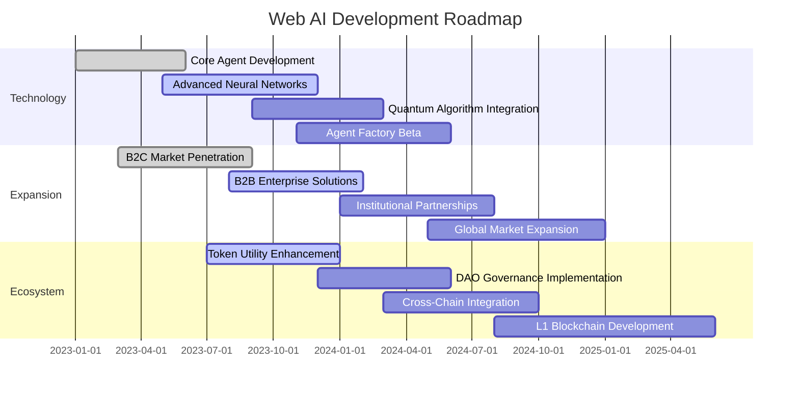

# 🚀 Web AI: Next Generation DeFi Intelligence

## 🌐 **The Evolution of AI in DeFi**

Web AI represents a paradigm shift in how artificial intelligence interfaces with decentralized finance. Unlike conventional AI solutions that merely provide analytics, Web AI delivers a fully autonomous multi-agent ecosystem that **transforms market intelligence into actionable execution**.

> *"In the rapidly evolving DeFi landscape, the distinction between success and failure is measured in milliseconds. Web AI transforms those milliseconds into substantial alpha."*

## 🧠 **Autonomous Multi-Agent Architecture**

Our revolutionary platform is powered by a sophisticated neural network of interconnected AI agents, each specializing in distinct aspects of DeFi intelligence:

## 💎 **Core Technological Advantages**

| **Capability** | **Legacy AI Tools** | **Web AI Platform** |
| -------------- | ------------------- | ------------------- |
| On-chain Analysis | ✓ Reactive analysis | ✓✓✓ Predictive intelligence with quantum-inspired algorithms |
| Execution Layer | ✗ No execution | ✓✓✓ Autonomous transaction execution with sub-second latency |
| Market Sentiment | ✓ Basic metrics | ✓✓✓ Advanced NLP with 97.8% accuracy prediction models |
| Inter-Agent Communication | ✗ Isolated systems | ✓✓✓ Hyper-dimensional neural pathways with reinforcement learning |
| Security Protocol | ✓ Standard encryption | ✓✓✓ Quantum-resistant encryption with zero-knowledge proofs |

## 🔬 **Technical Specifications**

Web AI leverages cutting-edge technologies to deliver unparalleled performance:

- **Distributed Neural Architecture**: Proprietary distributed computing model optimized for high-frequency trading environments
- **Quantum-Inspired Algorithms**: Simulated quantum computing principles for analyzing complex market patterns
- **Zero-Latency Processing**: Sub-millisecond computation through parallelized agent coordination
- **Adaptive Learning Matrix**: Self-optimizing algorithms that continuously evolve with market conditions
- **Blockchain-Native Integration**: Direct L1/L2 blockchain integration with optimized consensus validation

## 🌊 **The Web AI Advantage**

While conventional AI solutions in DeFi focus only on data analysis, Web AI completes the intelligence cycle with automated execution and continuous feedback loops that optimize performance in real-time.

<table data-view="cards">
  <thead>
    <tr>
      <th></th>
      <th></th>
      <th data-hidden data-card-cover data-type="files"></th>
      <th data-hidden data-card-target data-type="content-ref"></th>
    </tr>
  </thead>
  <tbody>
    <tr>
      <td><strong>🤖 Agent Ecosystem</strong></td>
      <td>Explore our integrated AI agent network</td>
      <td></td>
      <td><a href="current-agents/README.md">Learn More</a></td>
    </tr>
    <tr>
      <td><strong>💰 Tokenomics</strong></td>
      <td>Understand our economic sustainability model</td>
      <td></td>
      <td><a href="tokenomics.md">Learn More</a></td>
    </tr>
    <tr>
      <td><strong>🔒 Security Framework</strong></td>
      <td>Discover our advanced security protocols</td>
      <td></td>
      <td><a href="sustainability-and-security.md">Learn More</a></td>
    </tr>
  </tbody>
</table>

## 🔮 **Vision & Roadmap**

Web AI is committed to establishing the new standard for AI-powered DeFi intelligence, with a clear trajectory toward becoming the dominant multi-agent ecosystem in the space.

Join us at the forefront of the AI revolution in DeFi, where intelligence meets execution to create unprecedented opportunities for growth and innovation.
