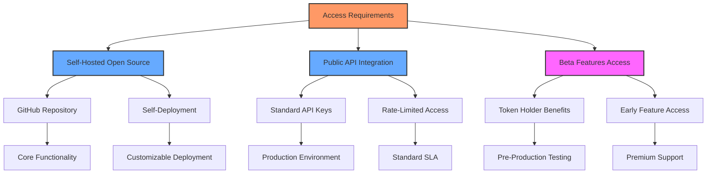
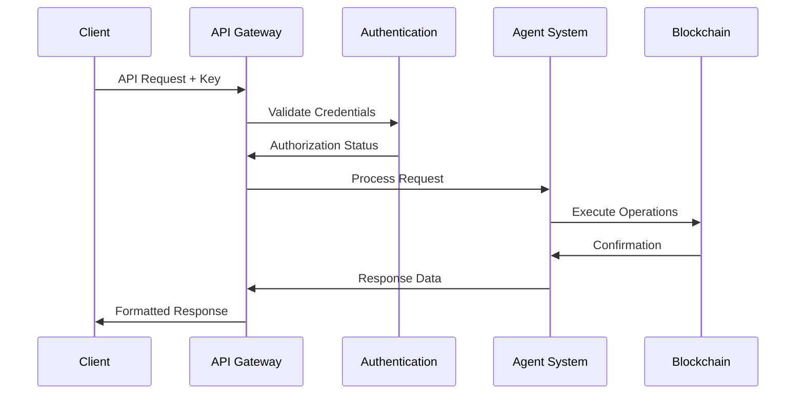
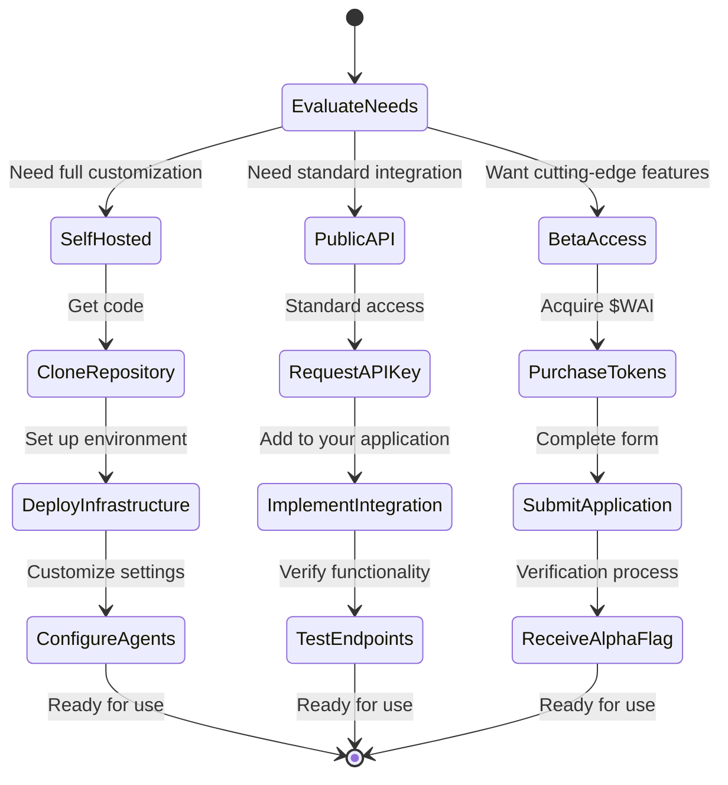

# 🔑 Access to API & Beta Features

## 🚪 **Getting Started with Web AI Ecosystem**

Web AI provides multiple pathways to access our powerful AI agent ecosystem, from public API integration to exclusive beta features. This guide will help you navigate the onboarding process based on your specific requirements and engagement level.

> *"Our technology stack is designed with flexibility in mind—whether you're a developer looking to integrate our API into custom solutions or a trader seeking early access to cutting-edge features, we've created streamlined pathways tailored to your needs."*

## 🔄 **Access Options Overview**

The Web AI platform offers three distinct access tiers, each providing increasing levels of capability and customization:

## 🧩 **Self-Hosted Open Source Option**

For developers seeking maximum control and customization, our core backend infrastructure is available as an open-source solution:

| **Deployment Option** | **Benefits** | **Requirements** |
| --------------------- | ------------ | ---------------- |
| Self-Hosted Backend | Complete control over infrastructure | Technical expertise in cloud deployment |
| Local Development | Full customization capability | Knowledge of Node.js and AI frameworks |
| Private Cloud Deployment | Enhanced security and privacy | Private cloud infrastructure access |

The open-source repository includes comprehensive documentation for deployment and customization:

- **GitHub Repository**: [github.com/webai-defi/webai-defi-core](https://github.com/webai-defi/webai-defi-core)
- **Documentation**: Step-by-step deployment guides and architecture diagrams
- **Community Support**: Developer forum for technical assistance

## 🔌 **Public API Integration**

For seamless integration with existing applications or services, our public API offers standardized access to core Web AI capabilities:

## 🌟 **Beta Features Access**

Gain exclusive early access to our most advanced features and agents before they're publicly available:

| **Beta Agent** | **Current Status** | **Availability Timeline** |
| -------------- | ------------------ | ------------------------- |
| Liquidity Agent | Pre-production testing | Available now for alpha users |
| Security Agent | Pre-production testing | Available now for alpha users |
| Automation Agent | Fine-tuning phase | Coming soon to alpha users |
| Arbitrage Agents | Fine-tuning phase | Coming soon to alpha users |

### 📝 **Beta Access Requirements**

Access to beta features is available to stakeholders with the following qualifications:

- **Token Holding**: Minimum $100 value in $WAI tokens
- **Account Verification**: Valid wallet ID logged in for at least 24 hours
- **Alpha Flag Status**: Granted by our team to qualifying accounts

### 🔗 **How to Apply for Beta Access**

To request access to our exclusive beta features, please complete our application form:

<table data-view="cards">
  <thead>
    <tr>
      <th></th>
      <th></th>
      <th data-hidden data-card-target data-type="content-ref"></th>
    </tr>
  </thead>
  <tbody>
    <tr>
      <td><strong>🧪 Beta Access Application</strong></td>
      <td>Complete our formal application process</td>
      <td><a href="https://docs.google.com/forms/d/1U7LJd3tVJj9urbSynAX7mr6IdLm5qOd5jV3aZxZgPpA/edit?usp=forms_home&ths=true">Apply Now</a></td>
    </tr>
  </tbody>
</table>

The application requires:
- Your email address
- Social media contact information (X/Telegram)
- Full wallet ID from chat.webaidefi.com
- Solana wallet ID where you've purchased $WAI tokens

## 📱 **Direct Contact Methods**

For expedited assistance or enterprise inquiries, you can reach our team directly:

- **Twitter/X**: [@WebAIDefi](https://x.com/WebAIDefi) (Send a direct message)
- **Enterprise Support**: For business partnerships and institutional access
- **Developer Relations**: For technical integration support

## 🔒 **Security & Compliance**

All API access methods adhere to our rigorous security standards:

- **API Key Encryption**: Enterprise-grade protection for access credentials
- **Rate Limiting**: Tiered access rates based on user level
- **Audit Logging**: Comprehensive request tracking and monitoring
- **Compliance Validation**: Automatic verification of usage within terms of service
- **Penetration Testing**: Regular security assessments of all access points

## 🚀 **Getting Started Checklist**

## 💡 **Use Case Recommendations**

| **User Profile** | **Recommended Access Path** | **Key Benefits** |
| ---------------- | --------------------------- | ---------------- |
| Individual Trader | Beta Features Access | Early access to advanced trading agents |
| Development Team | Self-Hosted Open Source | Customization and private deployment |
| Financial Institution | Enterprise API | Dedicated support and SLA guarantees |
| DeFi Protocol | Integration API | Seamless incorporation into existing systems |
| Research Organization | Open Source + Beta Access | Full visibility with cutting-edge features |

Join the Web AI ecosystem today and transform your approach to DeFi with the power of multi-agent artificial intelligence.
