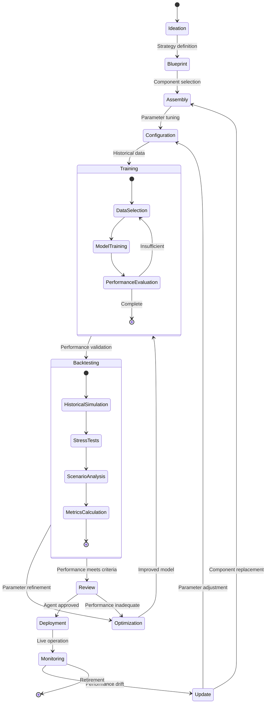
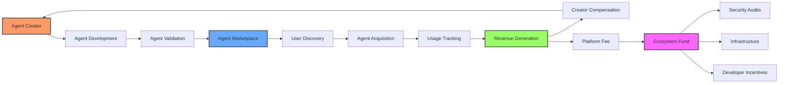
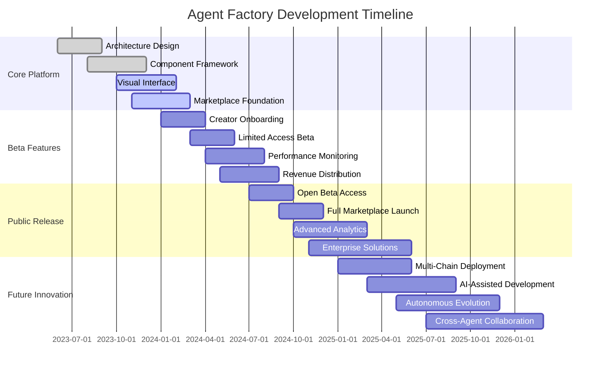

## 🔮 **The Future of Agent Development**

The Web AI Agent Factory represents a revolutionary paradigm shift in how AI agents are created, deployed, and monetized in the DeFi ecosystem. This groundbreaking platform empowers users to design, train, and deploy custom AI agents without requiring advanced technical expertise.

> *"The Agent Factory transforms Web AI from a platform into an ecosystem—where thousands of specialized agents continually evolve, compete, and cooperate to identify and execute the most profitable DeFi strategies available."*

## 🛠️ **No-Code Agent Development Interface**

Our intuitive visual interface allows users to build sophisticated AI agents through a modular, component-based approach:

```mermaid
graph TD
    A[Agent Factory Interface] --> B[Agent Blueprint Designer]
    A --> C[Component Library]
    A --> D[Training Environment]
    A --> E[Testing Framework]
    A --> F[Deployment Pipeline]
    
    B --> G[Visual Workflow Editor]
    B --> H[Parameter Configuration]
    B --> I[Agent Templating]
    
    C --> J[Data Connectors]
    C --> K[Analysis Modules]
    C --> L[Execution Components]
    C --> M[Strategy Primitives]
    
    D --> N[Reinforcement Learning]
    D --> O[Backtesting Engine]
    D --> P[Market Simulation]
    
    E --> Q[Performance Metrics]
    E --> R[Risk Assessment]
    E --> S[Comparative Analysis]
    
    F --> T[Version Control]
    F --> U[Compliance Validation]
    F --> V[Agent Marketplace]
    
    style A fill:#f96,stroke:#333,stroke-width:2px
    style B fill:#6af,stroke:#333,stroke-width:2px
    style C fill:#6af,stroke:#333,stroke-width:2px
    style D fill:#6af,stroke:#333,stroke-width:2px
    style E fill:#6af,stroke:#333,stroke-width:2px
    style F fill:#6af,stroke:#333,stroke-width:2px
```

## 🧩 **Modular Agent Architecture**

The Agent Factory employs a revolutionary component-based architecture that allows for unlimited agent customization:

| **Component Type** | **Available Modules** | **Customization Level** |
| ------------------ | --------------------- | ----------------------- |
| Data Sources | On-chain transactions, Exchange data, Social feeds, News APIs | Fully configurable data processing pipelines |
| Analysis Engines | Pattern recognition, Statistical modeling, ML prediction, Sentiment analysis | Adjustable parameters and optimization variables |
| Strategy Logic | Momentum trading, Arbitrage, Grid trading, Mean reversion | Custom logic with visual programming interface |
| Risk Management | Dynamic position sizing, Stop-loss mechanisms, Volatility adjustments | Parameterized risk models with simulation |
| Execution Layer | MEV-aware routing, Slippage protection, Transaction batching | Customizable execution parameters |

## 🔄 **Agent Development Lifecycle**

## 🚀 **Open-Source Extensibility**

The Web AI platform embraces the open-source ethos, enabling developers to contribute to our ecosystem:

- **Public API Documentation**: Comprehensive developer resources for agent creation
- **SDK Availability**: Language-specific Software Development Kits for programmatic integration
- **Component Marketplace**: Community-developed modules with revenue sharing
- **GitHub Integration**: Direct code repository connection for version control
- **CI/CD Pipeline**: Continuous integration and deployment for agent updates
- **Collaborative Development**: Multi-user agent creation with role-based access control

## 💰 **Agent Marketplace & Monetization**

The Agent Factory includes a sophisticated marketplace where creators can monetize their agents:

## 🔍 **Agent Validation & Security**

Prior to marketplace listing, all community-developed agents undergo rigorous validation:

- **Static Code Analysis**: Automated security scanning for vulnerabilities
- **Runtime Sandboxing**: Isolated execution environment to prevent unauthorized actions
- **Economic Model Validation**: Mathematical verification of strategy viability
- **Performance Benchmarking**: Standardized testing against reference datasets
- **Security Council Review**: Expert verification for complex agents
- **Formal Verification**: Mathematical proofs for critical components

## 📊 **Performance Analytics Dashboard**

The Agent Factory provides comprehensive analytics to measure agent performance:

| **Metric Category** | **Key Performance Indicators** | **Visualization** |
| ------------------- | ------------------------------ | ----------------- |
| Returns | ROI, Alpha, Sharpe Ratio, Sortino Ratio | Time-series charts with benchmark comparison |
| Risk Management | Maximum Drawdown, VaR, Expected Shortfall | Risk heatmaps and distribution curves |
| Execution Quality | Slippage, Timing Efficiency, Gas Optimization | Transaction cost analysis dashboard |
| Strategy Analysis | Win Rate, Profit Factor, Recovery Factor | Strategy attribution charts |
| Capital Efficiency | Capital Utilization, Turnover Ratio | Resource allocation visualizations |

## 🔮 **Agent Factory Roadmap**

## 🔗 **Integration With Existing Ecosystem**

The Agent Factory seamlessly integrates with the core Web AI platform:

- **Agent Communication Protocol**: Standardized messaging system between custom and core agents
- **Shared Intelligence Database**: Collaborative learning across the entire agent ecosystem
- **Unified Authentication System**: Single sign-on across development and production environments
- **Resource Optimization Engine**: Intelligent resource allocation for maximum efficiency
- **Cross-Agent Strategy Execution**: Coordinated execution across multiple specialized agents
- **Centralized Monitoring Console**: Unified dashboard for all running agents

The Agent Factory represents the next evolutionary step in the Web AI ecosystem—transforming our platform from a curated set of agents into an infinitely expandable universe of specialized AI trading intelligences. 
