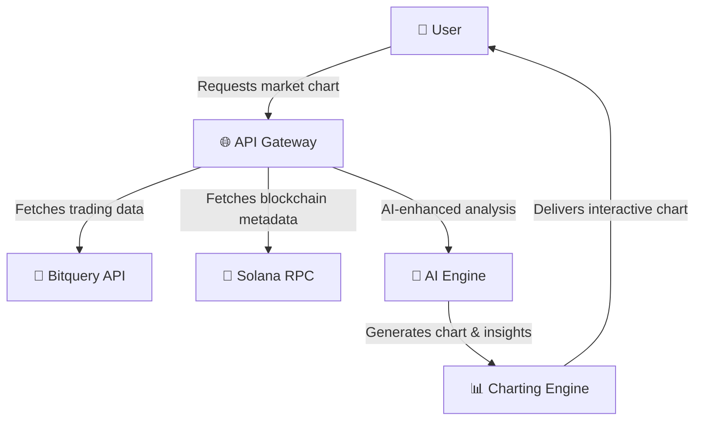
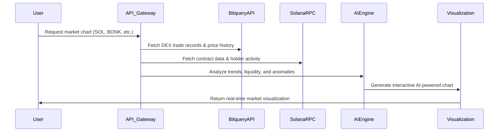
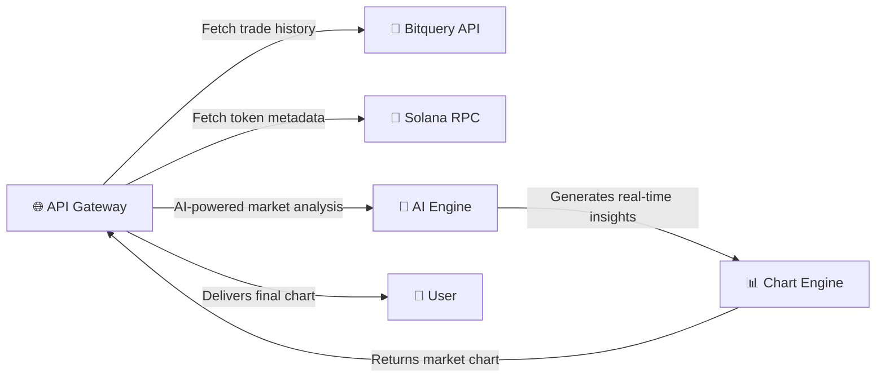
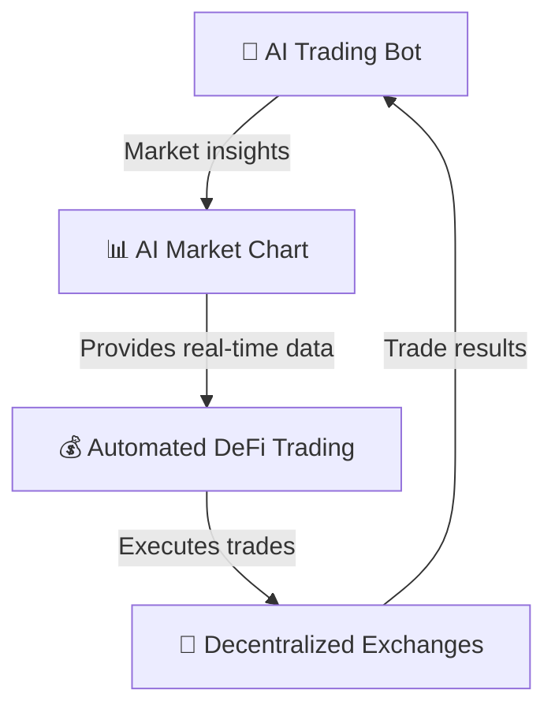
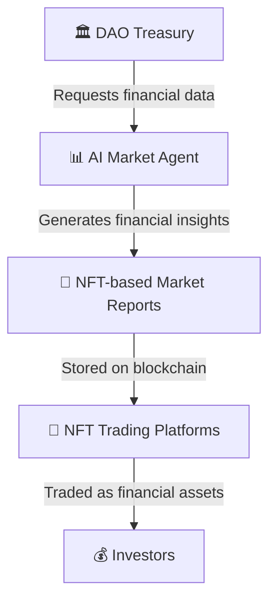
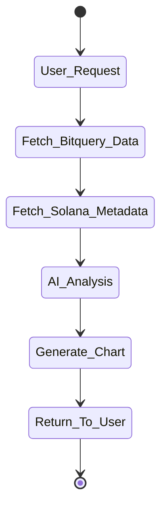
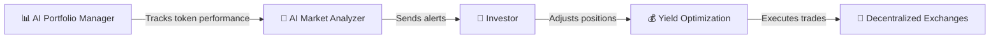
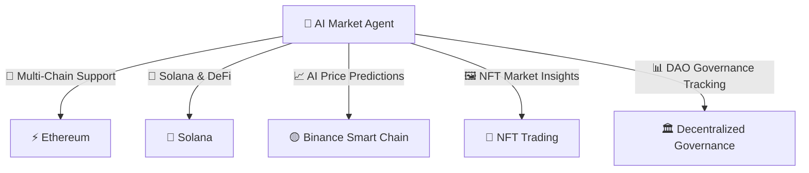

# Visualize Agent

# 🚀 AI-Powered Market Chart Agent on Solana  

## **What is this?**  
Welcome to the **next-gen AI financial infrastructure** built on Solana!  
This agent is an **on-demand, real-time, AI-driven market visualization tool** that transforms raw on-chain data into **clear, interactive, and actionable insights**.  

### **🌊 Ride the On-Chain Wave Like a Pro**
Forget scrolling through endless blockchain logs, trying to decipher raw transaction data.  
With **Web AI’s Visualize Agent**, you get **real-time graphical intelligence** on:  
- 🔥 **Whale trades** – Spot major token movements before they impact the market.  
- 💰 **Liquidity injections** – See exactly when and where capital flows into DeFi pools.  
- 🔗 **Smart contract interactions** – Get instant visibility into contract executions, token burns, and staking movements.  
- 📊 **Holder activity** – Analyze how token holders are behaving and predict market sentiment.  

This is **not just a charting tool**—it’s a **real-time, AI-enhanced, market intelligence dashboard** built for **instant decision-making**.  

🔥 **You ask – you get.**  
Just request a **chart for any Solana token**, and within seconds, get a **high-resolution, AI-enhanced price visualization**.  

---

## **How It Works?**  
### **1️⃣ You ask for a chart**  
- Provide the **mint address** of any Solana token.  
- Choose a **timeframe** (`1m`, `5m`, `15m`, `30m`, `60m`, `1d`, etc.).  
- Get **real-time** and **historical** market trends instantly.  

### **2️⃣ The AI Agent processes on-chain data**  
- Queries **Bitquery API** to extract **DEX trade records** and **liquidity movements**.  
- Fetches **open, high, low, close prices** + **volume & trade count**.  
- Leverages **AI-enhanced filtering** for **data accuracy & noise reduction**.  
- **Deciphers smart contract activity** and **tracks liquidity shifts in real-time**.  

### **3️⃣ You receive a powerful visualization**  
- AI-powered **charting engine** delivers **instant insights**.  
- **Visual-first interface** designed for **speed & clarity**.  
- Works seamlessly with **AI-driven DeFi protocols and DAOs**.  

🚀 **This means you can see the market BEFORE it moves.**  


---

### **📡 Overall Architecture: AI-Powered Market Chart Agent**

🚀 **How it works:**  
1️⃣ The **user requests a market chart** for any Solana token.  
2️⃣ The **API Gateway queries Bitquery API** for real-time trade data.  
3️⃣ The **Solana RPC fetches metadata** on supply, holders, and transactions.  
4️⃣ The **AI Engine processes trends**, liquidity shifts, and anomalies.  
5️⃣ The system **generates an AI-powered visualization** and delivers it instantly.  

---


### **📊 Trading Data Processing Flow**

🔥 **Key Features:**  
✅ **Real-time liquidity monitoring** – See where capital is flowing.  
✅ **Whale detection** – Track large trades before price shifts.  
✅ **DEX market activity** – Consolidated trading volume & price data.  
✅ **AI-driven anomaly detection** – Alerts on unusual trade patterns.  

---

## **Tech Stack & API Flow**  

### **🔧 Built with cutting-edge tools:**  
- **FastAPI** – The fastest Python framework for real-time AI agents 🚀  
- **Bitquery API** – Institutional-grade on-chain data provider 🏦  
- **HTTPx Async Requests** – Blazing-fast API calls for instant responses ⚡  
- **Pydantic Models** – Ensuring **clean & structured** data processing 🧠  
- **Auto-Error Handling** – No garbage data, only **reliable insights** ✅  

### **🔗 API Endpoint:**  
```http
GET /market-chart
```

| Parameter      | Type    | Description |
|---------------|---------|-------------|
| `mint_address` | `string` | Mint address of the token (e.g., `$SOL`, `$BONK`, etc.) |
| `interval`     | `string` | Time interval (`1m`, `5m`, `15m`, `30m`, `60m`, `1d`, `3d`, etc.) |

---

### **🔥 Example API Call**  
```bash
curl -X GET "https://yourapi.com/market-chart?mint_address=So11111111111111111111111111111111111111112&interval=1m"
```

### **📊 Example Response**  
```json
{
  "data": [
    {
      "Block": { "Timefield": "2025-02-13T12:00:00Z" },
      "Trade": {
        "open": 0.25,
        "high": 0.30,
        "low": 0.24,
        "close": 0.28
      },
      "count": "150",
      "volume": "1024.5"
    }
  ]
}
```

---

### **🔗 API & Data Processing Flow**

**Tech Stack Used:**  
- **FastAPI** – Ultra-fast API for real-time processing 🚀  
- **Bitquery API** – Institutional-grade on-chain data 🏦  
- **HTTPx Async Requests** – Instant response times ⚡  
- **Pandas & AI Models** – Cleans and structures blockchain data 🧠  
- **Matplotlib & Plotly** – High-quality visualizations 📊  

---

## **🌟 Futuristic Use Cases – Why This Changes Everything?**  
### **🚀 AI-Powered Trading Bots**  
This agent seamlessly integrates with **DeFi trading bots**, enabling:  
- ✅ **Automated trading strategies** based on real-time market shifts 🤖  
- ✅ **AI-driven decision-making** using historical price trends 📊  
- ✅ **Risk-adjusted yield farming** powered by live DEX trade data 🌾  

---

### **🚀 AI-Powered Trading Bots**

🔥 **How AI agents supercharge trading:**  
✅ **Automated AI-driven trades** – React instantly to liquidity shifts.  
✅ **Predictive analytics** – AI analyzes past trends for future moves.  
✅ **Risk-adjusted yield farming** – Smart capital allocation.  

---

### **💎 DAO-Driven NFT Financial Reports**  
Imagine turning **real-time trading data** into **NFT-based financial reports**!  
- **DAOs** can **mint and trade** NFT-based market insights 🎨  
- AI-generated **chart NFTs** become **on-chain tradeable assets** 📜  
- Full transparency & **decentralized financial reporting** for Web3 🌍  

### **📈 AI-Enhanced Portfolio Management**  
🔹 **Track & visualize** token performance **across multiple timeframes**  
🔹 **AI-powered alerts** detect **pump & dump schemes in real time**  
🔹 **Predictive analytics** to optimize **trading & staking strategies**  

---

### **💎 DAO-Powered NFT Financial Reports**

🔥 **Revolutionizing on-chain reporting:**  
✅ **AI-generated financial reports** – Fully decentralized and tradeable.  
✅ **On-chain analytics as NFTs** – Transparency meets blockchain.  
✅ **DAO-powered financial governance** – Trustless reporting for DeFi.  


---

### **⚡ AI-Enhanced Token Charting Flow**

💡 **Example Use Case:**  
🔹 **Crypto trader Alice** wants to analyze **a trending Solana token** before making an investment.  
🔹 She **queries the AI agent**, which **instantly returns a high-resolution trading chart**.  
🔹 The chart **highlights whale accumulation and liquidity trends**, showing **bullish momentum**.  
🔹 Alice **invests early** and **rides the price surge** like a pro. 💰  


---

### **📈 AI-Enhanced Portfolio Management**

💡 **What this means for investors:**  
🔹 **AI-powered portfolio tracking** – Stay ahead of market trends.  
🔹 **Smart alerts on whale trades & liquidity shifts**.  
🔹 **Real-time yield optimization** – Get the best DeFi returns.  

---

## **Why This Agent is a Web3 Game Changer?**  
🔥 **AI-driven speed** – No more slow, outdated blockchain explorers.  
💎 **On-chain purity** – 100% **raw, unfiltered** market data.  
📊 **Instant insights** – No need for **third-party charting tools**.  
🌍 **Fully decentralized** – Web3-native **trustless data transparency**.  


---

### **🔥 The Future of AI in Web3**

🔮 **Upcoming Features:**  
✅ **AI-driven price prediction models** – Get ahead of price movements.  
✅ **Automated NFT trend analysis** – See which collections are heating up.  
✅ **Cross-chain arbitrage signals** – Profit from inefficiencies across chains.  
✅ **AI governance tracking** – Monitor **DAO votes and policy changes**.  

---

💎 **This is the future of AI-powered blockchain analytics.**  
🔥 **Invest today or watch from the sidelines!** 🚀


