# Supervision Agent

## **What is this?** 
This chapter is all about our insanely powerful Supervision Agent. It’s not just some half-assed bot that scrapes random data and throws out guessy guesses. Hell no. This is your all-seeing, real-time, unstoppable AI beast that hunts down profits like a bloodthirsty, profit-obsessed maniac on a rampage.
If you’ve ever fantasized about being the first bastard to jump on the next big DeFi gem—before everyone else floods in—then buckle the fuck up.

## **Key features**
1. **Surveil the Market Like a Whale**
- **All-Seeing Vigilance**: With Supervision, you’re effectively slapping night-vision goggles onto the crypto markets. This Agent ferrets out wallet movements, liquidity migrations, cross-chain token flows, and more.
- **Whale Accumulation Alerts**: You want to know when the big dogs are piling into a token? Supervision tells you the very second it happens. It’s like having an inside line on the biggest moves before they go public.
- **Rug-Pull and Suspicious Activity Detection**: Spot shady bullshit from miles away. Supervision’s AI algorithms parse suspicious wallet activity, sudden liquidity dumps, and off-chain signals to warn you if a project is about to go poof.
- **Cross-Chain Oversight**: Ethereum, BSC, Polygon—name the chain, we’ve got it covered. Supervision leaps across networks faster than a caffeinated kangaroo.

2. **Buy Before the Crowd, Execute in Milliseconds**
- **Influencer & Insider Wallet Tracking**: Every top influencer’s wallet, every dev team’s pre-launch distribution, every suspicious insider address—Supervision’s got its beady eyes on it. The second they make a move, you know.
- **Instant Execution**: The moment a new contract address hits the blockchain or social feeds, Supervision can fling a buy order so fast, you’ll think it traveled by teleportation. Retail traders? They’re still sleeping.
- **Front-Run the Masses**: We’re not telling you to be a jerk, but if you want to snag those sweet early tokens before the masses, Supervision’s your BFF. Zero lag, zero hesitation, zero mercy.

## **How It Works?**  
### AI-Powered Monitoring
Our mother-loving neural networks are constantly chomping through real-time data from multiple block explorers, social networks, and aggregator platforms. We’re talking **Etherscan, BscScan, Polygonscan, DexTools, DexScreener**—you name it, we devour it.

### Proprietary Whale-Seeking Tech
We invented a specialized algorithm that cross-references **wallet address reputations, transaction patterns, and on-chain behaviors**. It’s like hooking your brain up to an ocean-sized sonar that pings whenever a whale so much as farts.

### Zero-Delay Transaction Execution
Our integration with **low-latency trading protocols** and the latest **WebSocket-based APIs** means we can shoot buy/sell orders into the mempool the instant an opportunity arises. Milliseconds matter, and we make them count.

### API-Fueled On-Chain Spying
- **Block Explorer APIs**: Etherscan, BscScan, Polygonscan for real-time chain queries.
- **Liquidity Aggregators**: We tap into multi-chain liquidity providers (e.g., 1inch, Matcha) for up-to-the-second pricing.
- **Social Scanners**: (Twitter, Telegram, Discord APIs) for that sweet early *“someone big just whispered about token X”* alpha.
- **AI & Natural Language Processing**: We built a savage custom model that combs through contract deploy logs and news feeds, trying to spot the next Shiba-level phenomenon.

### Trade Execution Modules
- **Auto-Swap**: Ties directly into Uniswap, PancakeSwap, SushiSwap, and every other DEX you can dream of, so you can jump in early and jump out with that big fat stack.
- **Slippage-Optimized Orders**: Because getting screwed on slippage is for amateurs and bag-holders.
- **Batch Trading**: Fire off multiple trades across different chains simultaneously. Because let’s face it—FOMO doesn’t do well with just one chain.

---

## Architecture Overview
Here’s a quick rundown of the main components that make **Supervision** as unstoppable as a bull on steroids:

```mermaid
graph TD;
    A[Supervision Agent] -->|Surveillance| B{Real-Time Data Ingestion}
    B --> C[Blockchain APIs: Etherscan, BscScan, Polygonscan]
    B --> D[Social APIs: Twitter, Telegram, Discord]
    B --> E[DEX APIs: Uniswap, PancakeSwap, SushiSwap]
    
    B -->|Processing| F{AI Engine: Grotesque-X}
    F --> G[Whale Tracking]
    F --> H[Rug-Pull Detection]
    F --> I[Market Manipulation Alerts]
    
    F -->|Execution| J{Trade Execution Module}
    J --> K[Instant Buy Orders]
    J --> L[Slippage Control]
    J --> M[Cross-Chain Swaps]

    M --> N[Profit 🤑]
```

### Data Harvesting Layer
- A cluster of unstoppable **data-gnawing AI submodules** that slam every relevant API for updated info.
- **Real-time WebSockets** keep the pipeline open 24/7, so your alpha feed never runs cold.

### Analysis & Prediction Engine
- Our proprietary AI engine, **Grotesque-X**, which merges **statistical models with deep neural nets** to predict if a whale movement is **bullish** or if a new token contract is a **scammy piece of crap**.
- **Sentiment analysis** that checks **influencer commentary** and **social media meltdown levels**.

### Execution Orchestrator
- Connects directly to **leading DEXs, aggregator protocols, and market-making services**.
- **Sub-second trade confirmations.** Because slow trades are for the sorry souls left in the dust.

---

## The Benefits

### Be the Freaking Whale
You don’t just watch whales; with **Supervision**, you **move like one**—making mammoth moves before the guppies even know what’s up.

```mermaid
sequenceDiagram
    participant User
    participant Supervision AI
    participant Blockchain API
    participant DEX API
    
    User->>Supervision AI: Enable Sniping Mode
    Supervision AI->>Blockchain API: Listen for new contract deployments
    Blockchain API-->>Supervision AI: New contract detected 🚀
    Supervision AI->>DEX API: Check liquidity & volume
    DEX API-->>Supervision AI: Liquidity found!
    Supervision AI->>DEX API: Place Buy Order ⚡
    DEX API-->>Supervision AI: Trade Executed ✅
    Supervision AI->>User: "You got in first! 🤑"
```

### Never Get Rugged Again
Supervision’s defense submodule is basically an **on-chain SWAT team**. It checks for:
- **Dev wallet shadiness**
- **Suspicious liquidity pulls**
- That dreaded **“honey pot” code** 

Save your precious capital for **real projects**, not **rug-pull nightmares**.

### Snipe Early-Stage Gems
The second a **new contract goes live** or is **rumored on Telegram**, the **Supervision Agent** is all over it—buying in so fast it’ll make your hamster wheel spin off its axle.

### Cross-Chain Domination
- **Ethereum gas fees too high?** Hop on **BSC**.
- **Bored with BSC?** Jump to **Polygon**.

Supervision **flows across multiple chains seamlessly**, letting you chase gains wherever they show up.

### Simple AF
- **Don’t know how to read a contract?**
- **Don’t know how to sniff out dev addresses?**

No problem. **This AI does the dirty work**, so you just **press a button** and watch your portfolio (hopefully) look like a **rocket to the moon**. 🚀

---

## Use Cases

### Swing Trading  
Catch **short-term volatility**. **Supervision** pings you the moment **big wallets** are taking positions or dumping.

### Long-Term Investing  
Track the **next potential 100x gem** from the moment it’s minted. **Supervision screams in your ear** if it sees **big, reputable wallets** diving in.

### Arbitrage  
Identify **cross-chain price discrepancies** before the copycats do. Because minted **USDT on Tron vs. USDT on ETH** can sometimes be *juicy*.

### Launch Sniping  
Be that **cutthroat investor** who snaps up tokens on **new DEX listings**, sometimes **literally seconds after they go live**.
