# 🎻 Web Ai Orchestrator Agent: The Mastermind of Multi-Agent Intelligence  
*The AI Conductor Transforming Decentralized Agent Networks Into Symphony of Profit*  

---

## 🌌 Conceptual Framework: Hyper-Optimized Task Orchestration  
**Next-Gen Multi-Agent System Architecture**  
The Orchestrator Agent isn't just a coordinator - it's an **AI-powered nervous system** for your entire Web Ai DeFi ecosystem. Using **dynamic task prioritization**, **conflict-resolution algorithms**, and **recursive agent delegation**, it transforms chaotic market data into **structured, actionable intelligence** with military-grade precision.  

```mermaid 
graph TD 
    User[👤 User Query] --> Orchestrator[🤖 Orchestrator Agent]
    Orchestrator -->|Task Decomposition| PriorityEngine[⚡ Priority Matrix]
    PriorityEngine --> Analyze[🧠 Analyze Agent]
    PriorityEngine --> Trade[💸 Trade Agent]
    PriorityEngine --> Sniper[🎯 Sniper Agent]
    subgraph Sub-Orchestration
        Analyze --> Research[🔍 Research Sub-Orchestrator]
        Research -->|Sub-Tasks| Competence[📚 Competence Agent]
        Research -->|Sub-Tasks| Supervision[👁️ Supervision Agent]
    end
    Analyze -->|Sentiment Data| Orchestrator
    Trade -->|Execution Report| Orchestrator
    Sniper -->|Opportunity Alert| Orchestrator
    Orchestrator -->|Synthesized Intelligence| User
```



---

## 🚀 Core Features: The Conductor's Baton  
### **1. AI-Powered Task Determinism Engine**  
- **Dynamic Intent Recognition**: Uses **transformer-based NLP** to decode user queries into executable agent workflows  
- **Multi-Objective Optimization**: Balances speed, cost, and accuracy using **quantum-inspired annealing algorithms**  


### **2. Recursive Orchestration Fabric**  
- **Nested Agent Hierarchies**: Sub-orchestrators like Research Agent manage their own agent networks  
- **25x Iteration Protocol**: Auto-retry failed tasks with alternative agents until success threshold met  

### **3. Conflict Resolution Matrix**  
**Three-Stage Consensus Protocol**:  
1. **Stochastic Best-of-N** sampling from agent outputs  
2. **Cross-Validation** against blockchain truth sources  
3. **Neural Truth Synthesis** using federated learning models  

---

## ⚙️ Technical Deep Dive: The Orchestration Stack  

### Layer 1: Intent Decoding & Task Graph Generation  
```python 
class OrchestrationEngine:
    def __init__(self):
        self.agent_registry = AgentKnowledgeGraph()
        self.qos_matrix = DynamicQoSMonitor()
    
    def process_query(self, query: str) -> TaskGraph:
        # Step 1: Semantic Intent Extraction
        intent = self.bert_nlp.predict_intent(query)
        
        # Step 2: Agent Capability Matching 
        candidate_agents = self.agent_registry.match_capabilities(intent)
        
        # Step 3: QoS-Based Task Graph Construction
        return TaskGraphBuilder.build(
            intent=intent,
            agents=candidate_agents,
            qos_metrics=self.qos_matrix.current_ratings
        )
```

### Layer 2: Distributed Task Execution  
**Multi-Agent Workflow Protocol**:  

```mermaid
sequenceDiagram
    participant Orchestrator
    participant Analyze
    participant Trade
    participant Sniper
    
    Orchestrator->>Analyze: 1. Market Sentiment Analysis (Priority 0.9)
    Orchestrator->>Trade: 2. Liquidity Check (Priority 0.7)
    Analyze-->>Orchestrator: Bearish Signal Detected
    Trade-->>Orchestrator: $2.5M Available
    Orchestrator->>Sniper: 3. Execute Short (Urgent)
    Sniper-->>Orchestrator: Position Opened
    Orchestrator->>User: 🚀 Short Executed at 2.4% Premium
```


### Layer 3: Neural Consensus Engine  
**Conflict Resolution Workflow**:  
1. Collect responses from N agents  
2. Generate truth-weighted embeddings  
3. Apply attention-based fusion  
4. Output calibrated final answer  

```mermaid
graph TD
    Conflict[🛑 Conflicting Agent Responses] -->|Raw Data| Embedding[🧠 Neural Embedding Layer]
    Embedding -->|Vector Space| Attention[🔍 Multi-Head Attention]
    Attention -->|Contextual Weights| Fusion[⚗️ Cross-Modal Fusion]
    Fusion -->|Calibrated Output| Consensus[✅ Verified Response]
```



---

## 🌐 Real-World Use Cases: Orchestration in Action  

### Case 1: VIP User Query - "Find undervalued altcoins before next market surge"  
**Orchestration Flow**:  
1. 🧠 Analyze Agent: Social sentiment analysis + influencer tracking  
2. 👁️ Supervision Agent: Whale accumulation patterns  
3. 💸 Trade Agent: Liquidity depth analysis  
4. 🔄 3 iterations with different parameter sets  
5. ⚖️ Conflict resolution between agents' predictions  
6. 🎯 Final output: Top 5 altcoins with execution strategy  

### Case 2: Institutional Client Request - "Secure $10M ETH position with max slippage <0.2%"  
**Multi-Agent Symphony**:  


---

## 🧠 Agent Knowledge Graph: The Orchestrator's Brain  
**Dynamic Capability Registry**:  
| Agent         | Input Schema          | Output Schema         | QoS Rating |
|---------------|-----------------------|-----------------------|------------|
| Sniper        | TokenAddress, ChainID | TxHash, PriceImpact   | 0.92       |
| Analyze       | SocialMediaQuery      | SentimentScore        | 0.88       |
| Competence    | ContractAddress       | RiskReport            | 0.95       |
| Supervision   | WalletAddress         | WhaleActivityReport   | 0.91       |

---

## 🚀 Why This Changes Everything: Investor Perspective  
**Three Pillars of Unmatched Value**:  
1. **Exponential Efficiency Gains**: 47% faster task completion vs. single-agent systems  
2. **Recursive Profit Multipliers**: Nested orchestration enables complex strategies impossible for human traders  
3. **AI-Generated Alpha Strategies**: Emergent behavior from agent interactions creates novel market opportunities  


---

## 🔮 Future Roadmap: The Evolution of Agent Orchestration  
**Q4 2024**: Cross-chain orchestration protocol  
**Q2 2025**: DeFi <> CeFi hybrid orchestration  
**2026**: Autonomous DAO powered by self-orchestrating agent swarm  

---

> 💡 **Final Investor Note**: This isn't just another AI tool - it's the **central nervous system for decentralized financial intelligence**. The Orchestrator Agent enables strategies and efficiencies that fundamentally alter the ROI landscape in Web3 markets. Early investors gain exposure to the **protocol layer of AI-driven DeFi** - the ultimate leverage point in the coming financial revolution. 🚀
