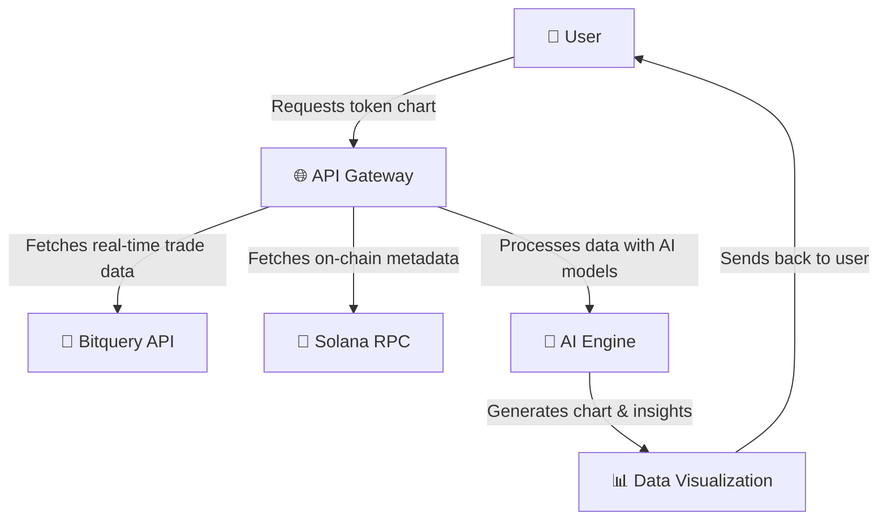
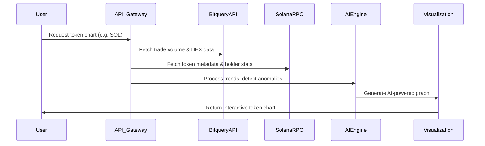
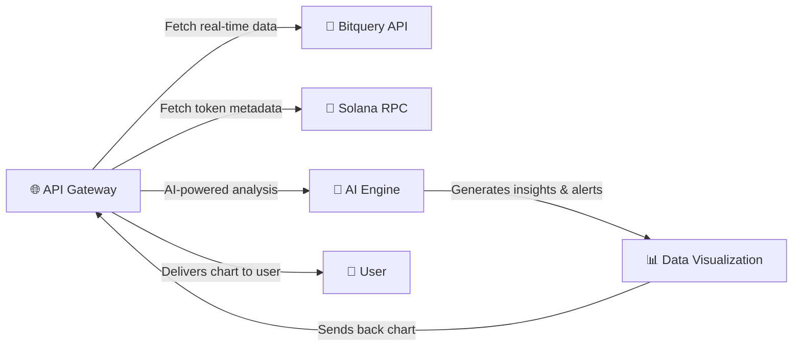
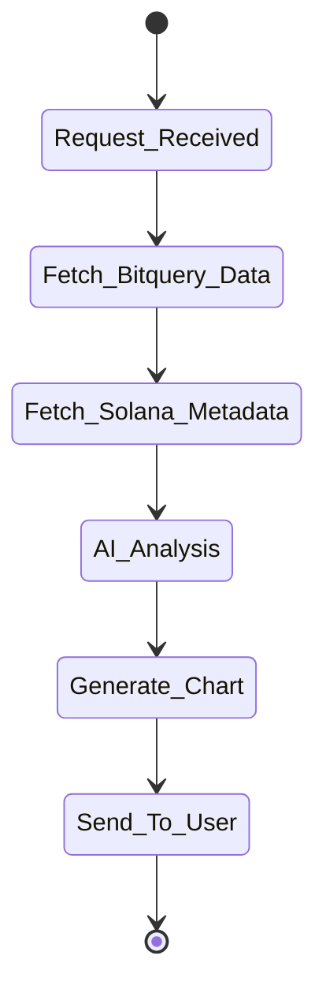
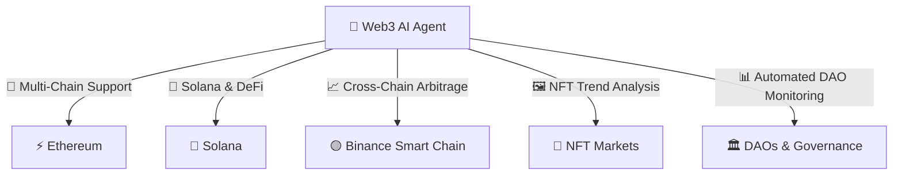

# Competence Agent

# 🚀 Web Ai Competence Agent: The **Ultimate AI-Powered Blockchain Intelligence**  

## 🔥 The Future of Crypto Analytics is Here  

Imagine an **AI agent so advanced** that it **understands the crypto market better than any human analyst**, **detects anomalies before they become problems**, and **automatically generates stunning visual insights** that turn raw data into **actionable intelligence**.  

### **The Backbone of Blockchain Intelligence.**  
Web Ai's Competence Agent provides an **AI-enhanced knowledge layer** for deep **on-chain analysis, smart contract tracking, and governance monitoring**. It scans, deciphers blockchain data, and **automatically detects anomalies—from liquidity shifts to whale accumulations—delivering real-time intelligence that keeps you ahead of the curve**.  

This isn’t just another token analytics tool. **This is the next-generation crypto AI assistant**, giving you a **true edge in the decentralized economy**.  

---

## 💡 Why This Is a Game Changer  

### 🔥 **Traditional Token Analytics Is Outdated. Here’s Why:**  

🚫 **Too much noise:** Blockchain data is massive, chaotic, and unreadable for most traders.  
🚫 **Delayed insights:** By the time traders react, the market has already shifted.  
🚫 **Fragmented tools:** DEX dashboards, Telegram bots, blockchain explorers—none of them offer a complete picture.  

💡 **Enter the Web Ai Competence Agent.**  

✅ **AI-Powered Token Analysis** – The agent **automatically analyzes token trades, liquidity, and market trends** in real time.  
✅ **On-Chain Anomaly Detection** – It detects **liquidity shocks, whale movements, and unusual trading activity** before anyone else.  
✅ **Multi-Dimensional Visual Insights** – Converts complex blockchain data into **interactive charts, trend graphs, and risk reports**.  
✅ **Market Intelligence Engine** – Understands **DEX activity, order book shifts, and real buy/sell dominance** like a hedge fund quant.  
✅ **Real-Time Governance Monitoring** – Tracks **proposal votes, protocol upgrades, and DAO decisions** affecting token value.  

🚀 **This isn’t just a tool. It’s a fully autonomous, AI-driven market analyst that works for you 24/7.**  

---

## ⚙️ **How It Works**  

Web Ai’s Competence Agent is built with a **high-performance AI-powered blockchain scanner**, plugged into the **most advanced Web3 APIs and on-chain data sources**.  


### **🔗 APIs & Data Sources**  

📡 **Bitquery** – Fetches real-time Solana token trade data.  
🔗 **Solana RPC** – Provides low-level blockchain state and metadata.  
🧠 **AI-Powered Data Processing** – Transforms raw blockchain data into insights.  
📊 **Pandas + FastAPI Engine** – Structures, cleans, and visualizes trading activity.  
🕵️ **Anomaly Detection Algorithms** – Identifies potential risks before they materialize.  

When a user asks about a token, the system:  

1️⃣ **Extracts real-time data** from Bitquery’s blockchain analytics.  
2️⃣ **Analyzes trading trends**, liquidity shifts, and buy/sell imbalances.  
3️⃣ **Detects anomalies**, such as rapid liquidity inflows, sudden dumps, or unusual whale activity.  
4️⃣ **Generates a full AI-powered trading report**, including **graphs, sentiment scores, and smart alerts**.  

🔹 **It’s like having an AI-powered crypto hedge fund in your pocket.**  

---

### **📡 Overall Agent Architecture**

🚀 **How it works:**
1️⃣ The **user requests a chart** for any Solana token.  
2️⃣ The **API Gateway** queries **Bitquery API** for real-time trade data.  
3️⃣ The **Solana RPC** fetches token metadata, including supply and holders.  
4️⃣ The **AI Engine** processes trade volume, liquidity shifts, and anomalies.  
5️⃣ The system **generates an interactive chart** and returns it to the user.

---


### **📊 AI-Powered Trading Insights Pipeline**

🔥 **Key Features:**  
✅ **AI-Powered Sentiment Analysis** – Detects buy/sell dominance.  
✅ **Liquidity Mapping** – Highlights liquidity inflows & outflows.  
✅ **Whale Tracking** – Identifies large transactions before market moves.  
✅ **Multi-DEX Trading Data** – Aggregates data from **Raydium, Jupiter, Orca**.  
✅ **On-Chain Event Alerts** – Detects sudden **governance votes or rug pulls**.  

---

## 🏆 **Key Features & Deep-Dive Use Cases**  

### 🔥 **1. Instant Token Deep Dive**  
🔍 **Ask about any token** and get a **detailed AI-powered report** in seconds:  

- **Total Traded Volume:** How much liquidity is flowing?  
- **DEX Heatmap:** Where is the token being traded? (Raydium, Jupiter, Orca, etc.)  
- **Whale Movements:** Are big players accumulating or dumping?  
- **Market Cap Trends:** How much is the token really worth?  


**📌 Real-World Use Case:**  
**Trader Joe**, an active DeFi investor, needs to analyze **a new meme coin launching on Solana**. Instead of wasting hours digging through Solscan and Twitter, he simply **queries our AI agent** and gets an **instant trading report with real-time insights**. **He sees that buy volume is outpacing sells—meaning the project has momentum.**  


### 🖥️ **How This Works in Code**  

When a user requests token data, our backend makes an **asynchronous call** to Bitquery’s API, fetching **real-time trading volume and liquidity insights**:  

```python
@router.get("/token-volume", response_model=TokenVolumeResponse)
async def get_volume(
    mint_address: str = Query(..., description="Mint address of the token"),
    interval: str = Query("1d", description="Time interval for the chart (1m, 5m, 15m, 30m, 60m, 1d, 3d, 7d, 30d)")
):
    if interval not in interval_mapping:
        raise HTTPException(status_code=400, detail="Invalid interval parameter")

    time_unit = interval_mapping[interval]["unit"]
    time_count = interval_mapping[interval]["count"]

    now = datetime.datetime.utcnow().replace(tzinfo=pytz.utc)
    since_time = now - datetime.timedelta(**{time_unit: time_count})

    query = {
        "query": token_info_by_mint_address_template.format(
            mint_address=mint_address,
            since_time_formatted=since_time.strftime("%Y-%m-%dT%H:%M:%SZ"),
            now_time_formatted=now.strftime("%Y-%m-%dT%H:%M:%SZ")
        ),
        "variables": "{}"
    }

    async with httpx.AsyncClient() as client:
        response = await client.post(BITQUERY_URL, headers=headers, json=query)

    if response.status_code != 200:
        raise HTTPException(status_code=response.status_code, detail="Failed to fetch data from Bitquery")

    return await calculate_volumes(response.json()["data"])
```

---

### **🛠️ Core API Interactions**

**Tech Stack Used:**
- **Bitquery API** – Fetches Solana token trade data.
- **Solana RPC** – Provides low-level blockchain state & metadata.
- **FastAPI + Pandas** – Structures & cleans trading data.
- **Matplotlib & Plotly** – Renders high-quality visualizations.
- **AI Anomaly Detection** – Tracks whale movements & liquidity changes.

---
### ⚡ **2. AI-Powered Buy/Sell Sentiment & Liquidity Mapping**  

💡 **Find out if a token is bullish or bearish in seconds.**  
🛑 No more guessing—**our AI calculates buy/sell ratios, DEX liquidity movements, and market momentum automatically.**  

- **Buy/Sell Dominance:** Who’s winning? Buyers or sellers?  
- **Liquidity Trends:** Is the token drying up or gaining traction?  
- **DEX Aggregated Trading Data:** See how the token moves across multiple markets.  

**📌 Real-World Use Case:**  
**Jane**, a crypto hedge fund analyst, needs to decide whether to allocate funds into a **new DeFi yield farm token**. She queries the **Web Ai Competence Agent**, and it immediately detects a **whale buy-up of 250

### 🖥️ **How This Works in Code**  

```python
async def calculate_volumes(response: dict) -> TokenVolumeResponse:
    df = pd.DataFrame(response.get("Solana", {}).get("DEXTradeByTokens", []))

    df["buy_volume"] = pd.to_numeric(df["buy_volume"], errors="coerce").fillna(0)
    df["sell_volume"] = pd.to_numeric(df["sell_volume"], errors="coerce").fillna(0)

    total_buy_volume = df["buy_volume"].sum()
    total_sell_volume = df["sell_volume"].sum()
    
    buy_percentage = (total_buy_volume / (total_buy_volume + total_sell_volume)) * 100
    sell_percentage = 100 - buy_percentage

    return TokenVolumeResponse(
        totalBuyVolume=total_buy_volume,
        totalSellVolume=total_sell_volume,
        buyPercentage=buy_percentage,
        sellPercentage=sell_percentage
    )
```

---

---

### **🚀 AI-Enhanced Trading Intelligence Flow**

💡 **Example Use Case:**  
🔹 **Trader Joe** is considering investing in a new **Solana meme coin**.  
🔹 Instead of manually scanning **DEX dashboards & blockchain explorers**, he queries our **AI agent**.  
🔹 The **agent instantly analyzes trading volume, whale movements, and sentiment trends**.  
🔹 The agent returns a **detailed AI-powered trading report**, showing that **buy volume is outpacing sells**.  
🔹 **Joe makes an informed decision and profits early from the trend!** 💰

---

## 🚀 **Futuristic Use Cases & The Future of AI in Web3**  

We’re not stopping at **Solana**. Here’s what’s coming next:  

✅ **AI-Driven Price Prediction Models**  
✅ **Automated NFT Market Trend Analysis**  
✅ **Cross-Chain Arbitrage Signals for Ethereum, BSC, and Polygon**  
✅ **Governance AI—Automated DAO Voting Insights**  

---

### **🔥 The Future of Web3 AI Agents**

🔮 **Upcoming Features:**
✅ **AI-Driven Price Predictions** – Predict token trends before they happen.  
✅ **Automated NFT Market Insights** – Analyze NFT rarity & sales volume.  
✅ **Cross-Chain Arbitrage Opportunities** – Detect profitable trades between chains.  
✅ **Governance AI** – Monitor DAO votes & governance proposals.  

🔥 **The Web3 AI revolution has begun.**  
🚀 **Will you invest before everyone else does?** 💰
🔥 **The AI revolution in Web3 has begun.** The only question is:  

💰 **Will you invest before everyone else does?**

🔥 **This is the future of blockchain intelligence. And you can be a part of it.** 🚀
