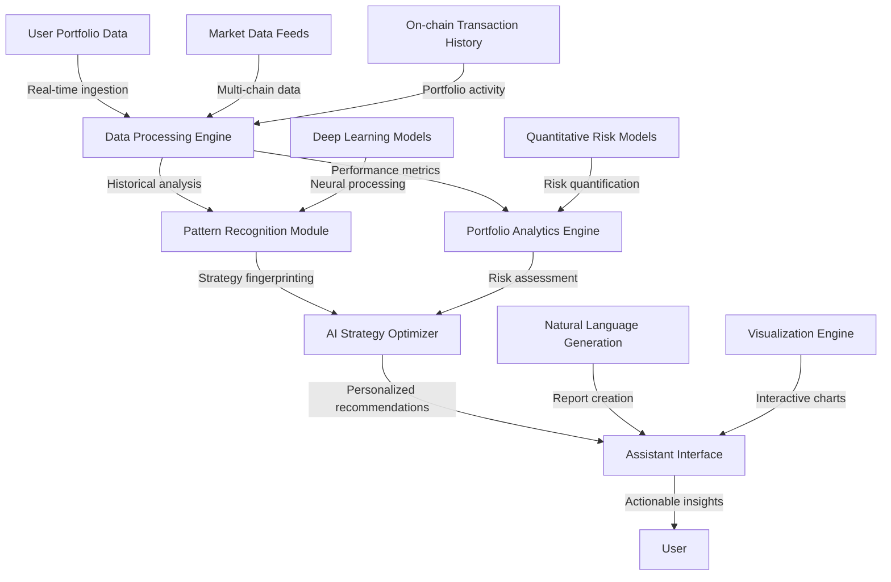
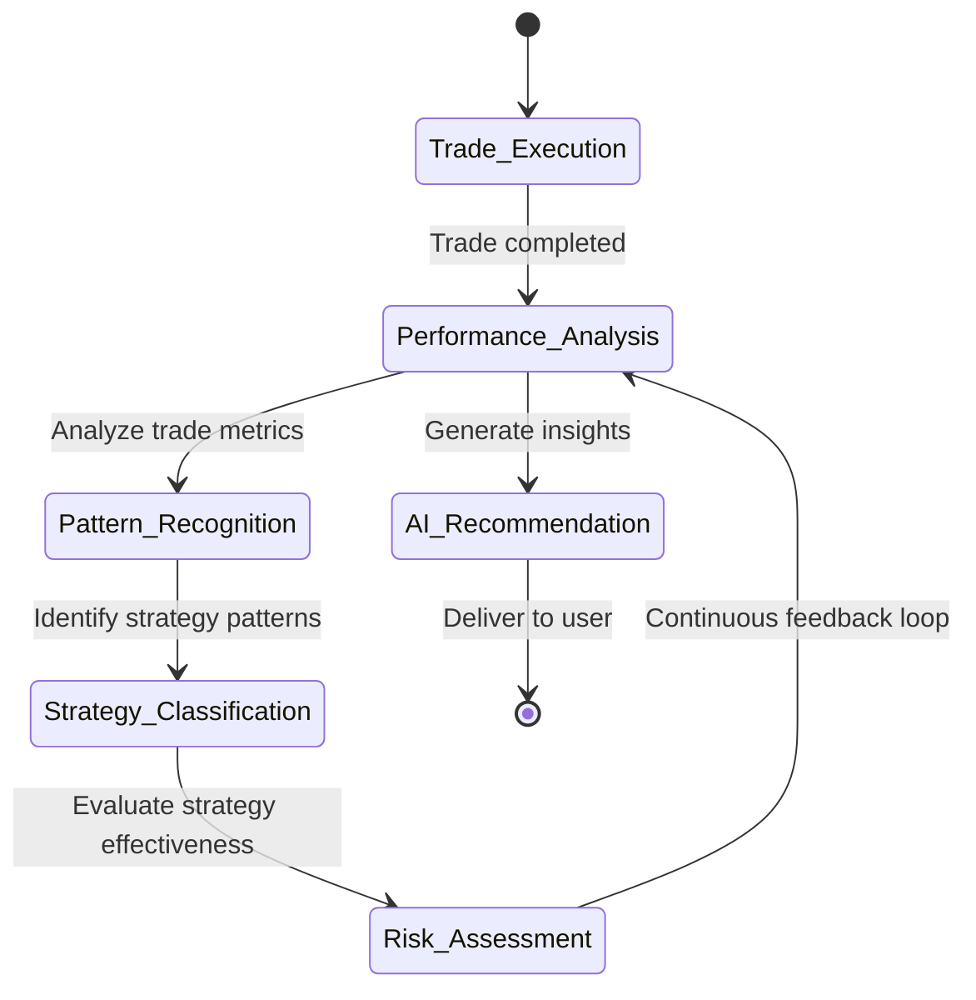
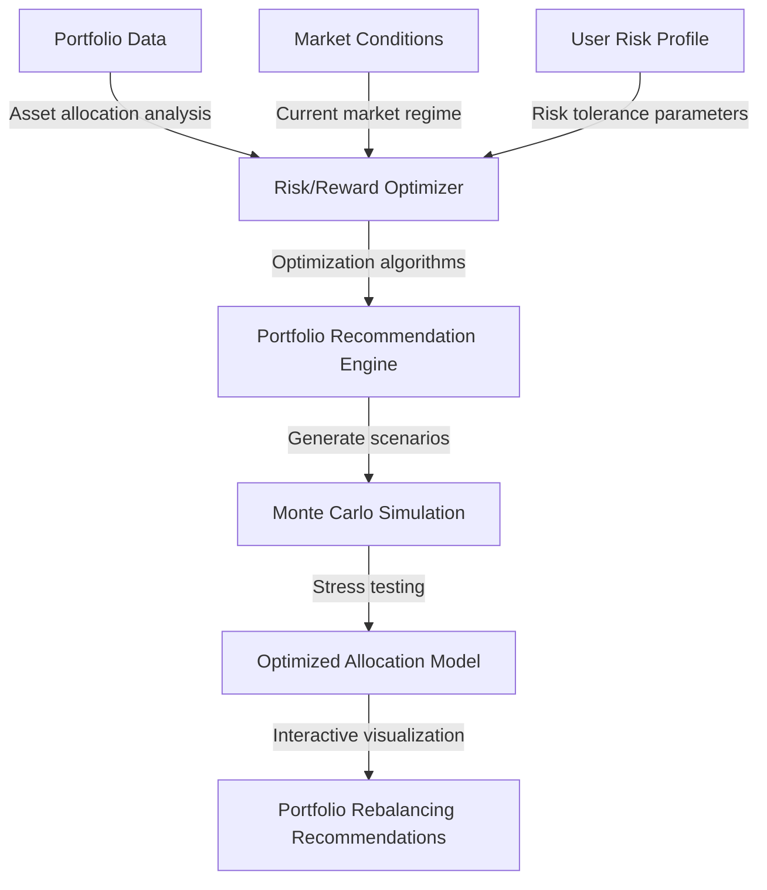
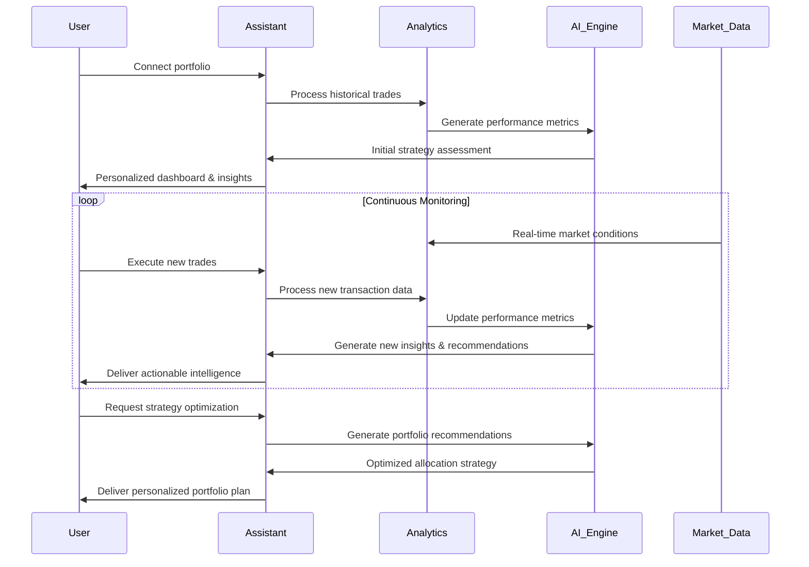
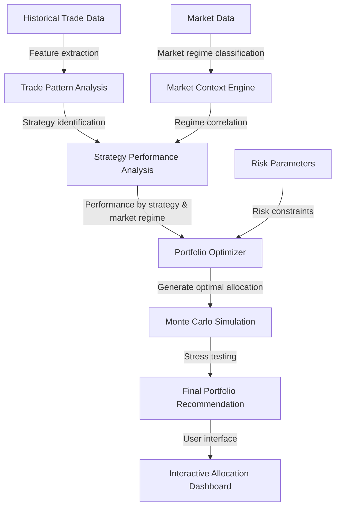

# 🤖 Assistant Agent: Your AI-Powered Portfolio Strategist

> **Transform random trading into strategic investing with an AI that thinks like a hedge fund quant**

The Assistant Agent isn't just another trading bot—it's your personal **Bloomberg Terminal on steroids**, powered by cutting-edge neural networks that analyze every aspect of your trading behavior. This sophisticated multi-agent system monitors your portfolio 24/7, identifying patterns invisible to the human eye and delivering institutional-grade insights that previously required a team of analysts.

## 🚀 TLDR: How Assistant Agent Revolutionizes Your Trading

The Assistant Agent leverages advanced machine learning to:

- 📊 Monitor your win rate, P&L, and position efficiency in real-time
- 🧠 Detect hidden patterns in your trading strategy across market cycles
- 💹 Generate AI-optimized portfolio allocations tailored to your risk profile
- 📈 Provide actionable trade suggestions based on historical performance
- 🔍 Identify blind spots and emotional biases affecting your execution
- 📱 Deliver personalized reports with specific improvement recommendations

**This isn't just portfolio tracking—it's your personal AI quant team working around the clock.**

## 🧩 Technical Architecture: The Neural Backbone



The Assistant Agent processes millions of data points through specialized neural networks designed to identify subtle patterns in trading behavior that humans typically miss. By connecting your historical performance with market conditions, the system develops a comprehensive understanding of your trading style, strengths, and weaknesses.

## 🛠️ Core Capabilities: Beyond Basic Portfolio Tracking

### 🔬 Advanced Performance Analytics



The Assistant doesn't just track P&L—it dissects your trading with institutional-grade metrics:

- **Win Rate Analytics**: Beyond basic win/loss ratios, the system analyzes conditional probabilities based on market conditions, entry timing, and position sizing
- **Trade Efficiency Scoring**: Proprietary algorithms that measure how effectively you capture available price movements
- **Drawdown Profiling**: Advanced analysis of drawdown patterns, recovery rates, and correlation with specific trading behaviors
- **Position Timing Optimization**: AI-powered analysis of your entry and exit timing relative to ideal execution points

### 🧠 Strategy Pattern Recognition

The Assistant's neural networks identify your unconscious trading patterns and strategy preferences:

- **Strategy Fingerprinting**: Automatically classifies your trades into recognized strategies (momentum, mean-reversion, breakout, etc.)
- **Market Regime Correlation**: Maps your performance to specific market conditions to identify when your strategies perform best
- **Emotional Bias Detection**: Identifies patterns consistent with fear, greed, or overconfidence affecting decision-making
- **Execution Quality Analysis**: Measures slippage, timing accuracy, and position sizing consistency across different market conditions

### 📊 AI-Driven Portfolio Optimization



Transform your portfolio with quantitative optimization techniques previously available only to institutional investors:

- **Cross-Asset Correlation Analysis**: Identifies hidden correlations across your holdings to reduce overall portfolio risk
- **Position Sizing Optimization**: Calculates optimal position sizes based on volatility, correlation, and personal risk parameters
- **Diversification Efficiency Scoring**: Measures the effective diversification of your portfolio beyond simple asset counts
- **Risk-Adjusted Return Optimization**: Suggests allocation changes to maximize Sharpe ratio and other risk-adjusted performance metrics

### 📱 Personalized Trading Intelligence

Unlike generic market analysis, the Assistant Agent tailors all insights specifically to your trading history and preferences:

- **AI-Generated Trade Reports**: Receive natural language summaries of your trading performance with specific improvement suggestions
- **Strategy Performance Breakdowns**: See which strategies work best for you across different market conditions
- **Blind Spot Identification**: Proactive alerts about market opportunities you consistently miss based on historical behavior
- **Skill Development Roadmap**: Personalized learning recommendations based on identified weaknesses in your trading execution

## 🔄 User Workflow: The Intelligence Cycle



## 💡 Real-World Applications That Transform Your Trading

### 🎯 Case Study: The Weekend Trader

A part-time trader who can only analyze markets on weekends connects their portfolio to the Assistant Agent. The system identifies that:

1. Their win rate drops significantly on Monday trades (emotional FOMO after weekend research)
2. They consistently exit profitable positions too early on volatile assets
3. Their best-performing strategy is actually breakout trading, not the value investing they thought they preferred

The Assistant provides specific recommendations:
- Adjust position sizing for Monday trades to reduce risk
- Implement trailing stops with specific parameters based on asset volatility
- Focus on breakout setups with custom alerts for ideal entry conditions

**Result**: 37% improvement in overall portfolio performance within 60 days.

### 🏆 Case Study: The Multi-Strategy Investor

An experienced investor managing multiple strategies across DeFi, NFTs, and traditional crypto assets struggles to optimize their overall allocation. The Assistant Agent:

1. Identifies unexpected correlations between their DeFi yield farming and NFT trading performance
2. Detects that their stablecoin yield strategy actually underperforms on a risk-adjusted basis
3. Reveals that their small-cap altcoin trades show strong seasonal patterns

The system generates a comprehensive reallocation plan with:
- Reduced exposure to correlated DeFi/NFT sectors during specific market conditions
- Alternative stablecoin strategies with superior risk-adjusted returns
- Timing recommendations for altcoin allocation based on identified seasonality

**Result**: 22% reduction in portfolio volatility while maintaining similar returns.

## 🧪 Technical Implementation: Under The Hood

The Assistant Agent leverages state-of-the-art technology to deliver institutional-grade portfolio intelligence:

```python
# Sample code snippet: Strategy Pattern Recognition Module
import numpy as np
import pandas as pd
from sklearn.ensemble import RandomForestClassifier
from transformers import AutoModelForSequenceClassification

class StrategyClassifier:
    def __init__(self, model_path="models/strategy_classifier_v3.2"):
        self.pattern_model = RandomForestClassifier(n_estimators=500, max_depth=25)
        self.sentiment_model = AutoModelForSequenceClassification.from_pretrained(model_path)
        self.strategy_types = ["momentum", "mean_reversion", "breakout", "value", "trend_following"]
        
    def process_trade_data(self, trade_history_df):
        """Process trade history to extract strategy features"""
        # Extract temporal features
        trade_history_df["entry_time_norm"] = self._normalize_time_features(trade_history_df["entry_timestamp"])
        trade_history_df["holding_period"] = (trade_history_df["exit_timestamp"] - trade_history_df["entry_timestamp"])
        
        # Calculate market condition features
        trade_history_df["market_volatility"] = self._calculate_market_volatility(
            trade_history_df["entry_timestamp"], window=24)
        trade_history_df["market_trend"] = self._calculate_market_trend(
            trade_history_df["entry_timestamp"], window=72)
            
        # Extract position sizing patterns
        trade_history_df["position_size_rel"] = trade_history_df["position_size"] / trade_history_df["portfolio_value"]
        
        # Calculate trade performance metrics
        trade_history_df["roi"] = (trade_history_df["exit_price"] - trade_history_df["entry_price"]) / trade_history_df["entry_price"]
        trade_history_df["win"] = trade_history_df["roi"] > 0
        
        return self._engineer_strategy_features(trade_history_df)
    
    def identify_dominant_strategies(self, feature_df, min_confidence=0.75):
        """Identify dominant trading strategies from feature dataframe"""
        X = feature_df.drop(["trade_id", "entry_timestamp", "exit_timestamp", "roi", "win"], axis=1)
        
        # Apply model to classify strategies
        strategy_probabilities = self.pattern_model.predict_proba(X)
        
        # Identify trades with high-confidence strategy classifications
        dominant_strategies = {}
        for i, strat in enumerate(self.strategy_types):
            confident_trades = feature_df.loc[strategy_probabilities[:, i] >= min_confidence, "trade_id"].tolist()
            if confident_trades:
                dominant_strategies[strat] = {
                    "trade_count": len(confident_trades),
                    "win_rate": self._calculate_win_rate(feature_df, confident_trades),
                    "avg_roi": self._calculate_avg_roi(feature_df, confident_trades),
                    "confidence": np.mean(strategy_probabilities[:, i][strategy_probabilities[:, i] >= min_confidence])
                }
        
        return dominant_strategies
    
    def _normalize_time_features(self, timestamps):
        """Convert timestamps to cyclical time features"""
        # Implementation details...
        
    def _calculate_market_volatility(self, timestamps, window=24):
        """Calculate market volatility during trade periods"""
        # Implementation details...
    
    def _calculate_market_trend(self, timestamps, window=72):
        """Calculate market trend during trade periods"""
        # Implementation details...
        
    def _engineer_strategy_features(self, df):
        """Engineer features specific to strategy identification"""
        # Implementation details...
        
    def _calculate_win_rate(self, df, trade_ids):
        """Calculate win rate for a subset of trades"""
        return df.loc[df["trade_id"].isin(trade_ids), "win"].mean()
        
    def _calculate_avg_roi(self, df, trade_ids):
        """Calculate average ROI for a subset of trades"""
        return df.loc[df["trade_id"].isin(trade_ids), "roi"].mean()
```

## 📊 AI Portfolio Optimization Process



The Assistant Agent processes your trade data through sophisticated AI pipelines:

1. **Data Ingestion Layer**: Seamlessly connects to your wallets and exchanges via secure APIs
2. **Feature Extraction Engine**: Processes raw trade data into hundreds of meaningful features
3. **Strategy Classification Models**: Uses ensemble machine learning to identify trading patterns
4. **Market Regime Detector**: Classifies market conditions to provide contextual performance analysis
5. **Optimization Algorithms**: Applies advanced portfolio theory to generate allocation recommendations
6. **Natural Language Generation**: Translates complex analyses into easy-to-understand reports

## 🔮 What's Next: The Evolution of Trading Intelligence

The Assistant Agent is continuously evolving with new capabilities on our development roadmap:

### Phase 1: Advanced Pattern Recognition (Completed)
- ✅ Multi-strategy classification
- ✅ Win rate analytics
- ✅ Basic portfolio optimization

### Phase 2: Predictive Intelligence (Current)
- ✅ Trade timing optimization
- ✅ Risk-adjusted allocation models
- ✅ Position sizing recommendations
- 🔄 Emotional bias detection

### Phase 3: Autonomous Optimization (Coming Q2 2025)
- 🔜 Real-time strategy adjustment recommendations
- 🔜 Market regime-based allocation switching
- 🔜 Personalized strategy development
- 🔜 Custom indicator generation

### Phase 4: Cross-Chain Intelligence (Coming Q4 2025)
- 🔜 Unified cross-chain portfolio view
- 🔜 Chain-specific strategy optimization
- 🔜 Correlation-based chain diversification
- 🔜 Gas-optimized execution recommendations

## 🔐 Security & Privacy: Your Data, Protected

The Assistant Agent was built with security as a foundational principle:

- **Zero-Knowledge Processing**: All sensitive data is processed with zero-knowledge encryption
- **No Private Key Access**: The system never requires or has access to your private keys
- **Encryption Standards**: AES-256 encryption for all data at rest and in transit
- **Anonymized Analytics**: All user data is anonymized for training and improvement purposes
- **Compliance Ready**: Built to meet stringent regulatory requirements across jurisdictions

## 💎 Why Assistant Agent is a Game-Changer for Traders

Most portfolio trackers simply show you what happened. The Assistant Agent tells you **why it happened, what it means, and what you should do next**.

This isn't just another analytics dashboard—it's a fundamental reimagining of what trading intelligence can be in the age of AI. By combining cutting-edge machine learning with deep expertise in quantitative finance, we've created a system that helps traders at any level make better decisions, avoid costly mistakes, and continuously improve their performance.

### Transform Your Trading Today:
- 🚀 Connect your portfolio in under 2 minutes
- 📊 Receive your first AI-powered analysis within 24 hours
- 💰 Start implementing optimizations that can dramatically improve your results

**Are you ready to trade with the power of AI on your side?**
