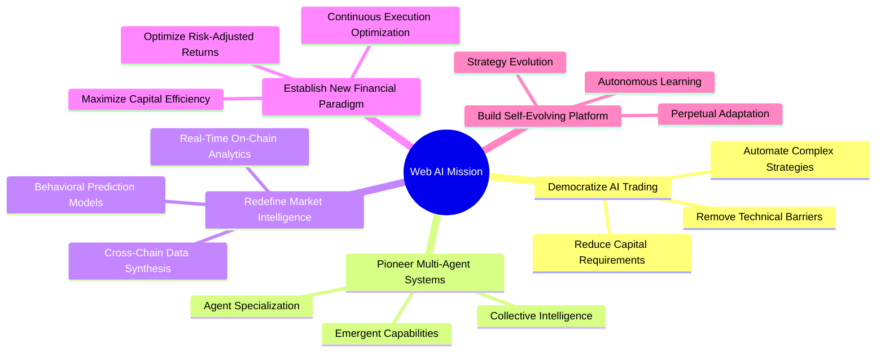
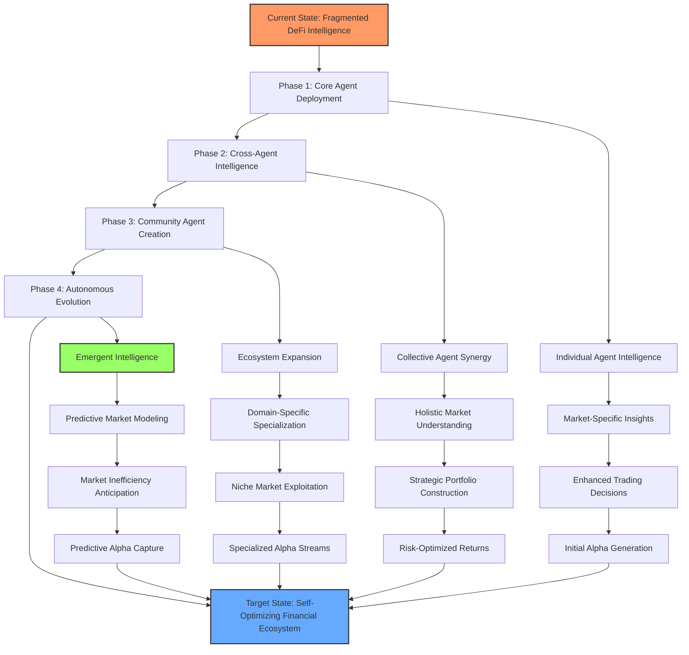
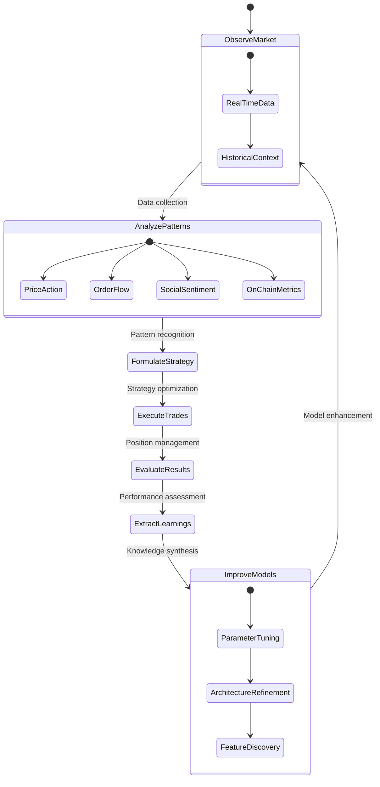

# 🌟 Mission & Vision

## 🔭 **Our Defining Purpose**

Web AI exists to democratize access to institutional-grade artificial intelligence in decentralized finance, creating a more efficient, transparent, and equitable financial ecosystem through autonomous multi-agent systems.

> *"We don't just predict the future of finance—we're building it, one algorithm at a time. Our mission transcends trading; we're creating an entirely new paradigm of financial intelligence that operates at the intersection of AI, blockchain, and decentralized governance."*

## 🎯 **Strategic Objectives**

Our organization is driven by a set of transformative objectives that guide our technological development and market approach:

## 💫 **Core Values & Principles**

The foundation of our organization is built upon unwavering principles that inform every decision and development choice:

| **Core Value** | **Manifestation** | **Implementation** |
| -------------- | ----------------- | ------------------ |
| Technical Excellence | Uncompromising commitment to cutting-edge AI | Quantum-inspired algorithms with continuous optimization |
| Radical Transparency | Open-source core infrastructure | Public codebase with comprehensive documentation |
| Decentralized Governance | Community-driven decision making | Progressive decentralization through $WAI token voting |
| Continuous Innovation | Relentless pursuit of breakthrough capabilities | 25% of resources dedicated to experimental R&D |
| Ethical Intelligence | Responsible AI deployment | Fairness metrics and bias detection in all models |
| User Empowerment | Democratized access to institutional capabilities | No-code interfaces with progressive complexity |

## 🚀 **From Vision to Reality**

Web AI is executing a methodical transformation of the DeFi landscape through our strategic implementation roadmap:

## 🌍 **Impact & Transformation**

Web AI is committed to creating profound change within the financial ecosystem:

- **Democratizing Advanced Trading**: Bringing institutional-grade AI trading capabilities to individual investors
- **Reducing Information Asymmetry**: Leveling the playing field between retail and institutional participants
- **Optimizing Capital Efficiency**: Maximizing returns through continuous algorithmic improvement
- **Increasing Market Liquidity**: Enhancing market depth through intelligent execution strategies
- **Accelerating DeFi Innovation**: Providing an open platform for financial experimentation
- **Cultivating Financial Intelligence**: Creating an ecosystem of specialized trading knowledge

## 🔄 **Continuous Evolution**

As a self-improving system, Web AI embraces an evolutionary philosophy of perpetual enhancement:

## 🔮 **Beyond Trading: The Future of Financial Intelligence**

Web AI's vision extends beyond cryptocurrency trading to reshape the fundamental nature of financial interaction:

- **Autonomous Financial Agents**: Personalized financial management through dedicated AI
- **Intelligent Capital Allocation**: Optimal resource distribution across the entire DeFi ecosystem
- **Predictive Economic Modeling**: Anticipating macro trends through collective intelligence
- **Cross-Chain Optimization**: Seamless capital movement to maximize opportunities
- **Governance Automation**: AI-enhanced decision making for protocol governance
- **Financial Singularity**: The emergence of a self-optimizing financial ecosystem

We invite you to join us on this transformative journey as we build the intelligent financial infrastructure of tomorrow—today.
