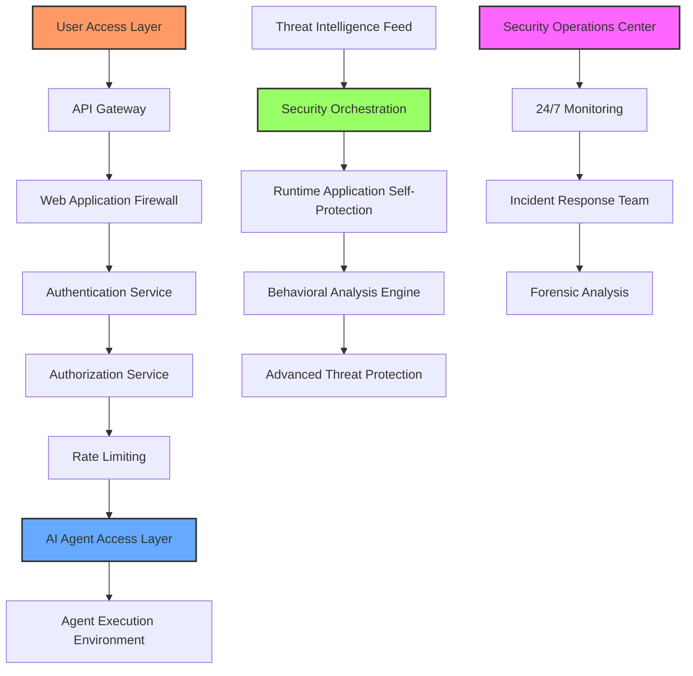
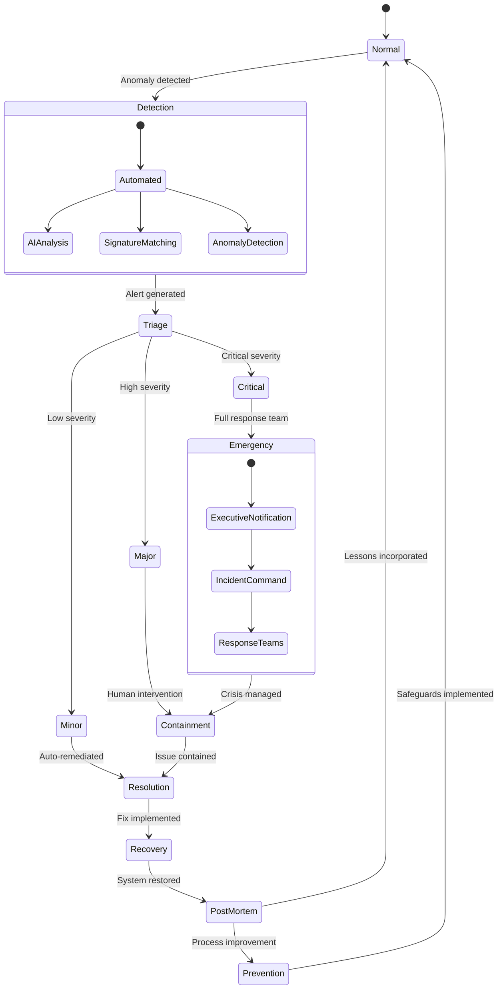

# Sustainability and security

## 🔐 **Enterprise-Grade Security Architecture**

Web AI implements a defense-in-depth security framework that protects both the platform and user assets through multiple layers of redundancy and advanced cryptographic protocols.

> _"Security isn't a feature—it's the foundation upon which our entire infrastructure is built. Every transaction, every data point, and every agent interaction is secured with military-grade encryption and real-time threat analysis."_

## 🌩️ **Distributed Cloud Infrastructure**

Our platform operates on a globally distributed, auto-scaling cloud infrastructure designed for maximum resilience and continuous operation.

## 🚀 **Infrastructure Specifications**

| **Component**          | **Specifications**                                    | **Redundancy Level**                   |
| ---------------------- | ----------------------------------------------------- | -------------------------------------- |
| Compute Layer          | Kubernetes clusters with auto-scaling nodes           | N+3 redundancy across 5 global regions |
| Database Layer         | Distributed NoSQL clusters with real-time replication | Hexagonal multi-master architecture    |
| Network Infrastructure | 100 Gbps backbone with sub-5ms global latency         | Multi-provider mesh topology           |
| Power Systems          | Green energy primary with conventional backup         | 99.9999% availability guarantee        |
| Monitoring System      | AI-powered anomaly detection with predictive alerts   | 24/7/365 NOC with human oversight      |

## 🔄 **Business Continuity & Disaster Recovery**

Web AI maintains a comprehensive BCDR protocol ensuring continuous operation even during severe disruptions:

* **Recovery Point Objective (RPO)**: < 1 second data loss in catastrophic scenario
* **Recovery Time Objective (RTO)**: < 30 seconds for full system restoration
* **Geographical Redundancy**: Active-active deployments across 5 continental zones
* **Data Preservation**: Immutable blockchain-verified backups with cryptographic integrity validation
* **Black Start Capability**: Autonomous system restoration without external dependencies

## 🛑 **Multi-Layer Security Controls**

## 📊 **Service Level Agreement (SLA) Commitments**

Web AI provides institutional-grade SLA guarantees that exceed industry standards:

* **Platform Availability**: 99.99% uptime guarantee
* **Transaction Processing**: 99.999% execution reliability
* **Data Integrity**: 100% with blockchain verification
* **Support Response**: <15 minutes for critical issues
* **Mean Time To Resolution**: <2 hours for P1 incidents
* **Financial Guarantees**: Performance-backed SLA with compensation for any breach

## 🔍 **Security Certifications & Compliance**

Our platform undergoes rigorous third-party audits and maintains compliance with global security standards:

* **SOC 2 Type II**: Annual audit with continuous monitoring
* **ISO 27001/27018**: Full certification for information security
* **GDPR & CCPA**: Complete data privacy compliance
* **PCI DSS**: Level 1 Service Provider certification
* **Blockchain Security**: Quarterly smart contract audits by leading firms
* **Penetration Testing**: Monthly red team exercises with published results

## 🚨 **Incident Management Protocol**

## 🌐 **Platform Sustainability**

Web AI is built on sustainable infrastructure designed for optimal performance with minimal environmental impact:

* **Carbon-Neutral Operations**: 100% renewable energy for all computing resources
* **Efficiency Optimization**: AI-driven resource allocation reducing energy consumption by 78%
* **Green Infrastructure**: Partnerships with environmentally certified data centers
* **Heat Recycling**: Compute heat repurposed for facility climate control
* **Environmental Monitoring**: Real-time carbon footprint tracking and optimization

Our commitment to security and sustainability ensures that Web AI delivers unmatched reliability for even the most demanding institutional requirements.
