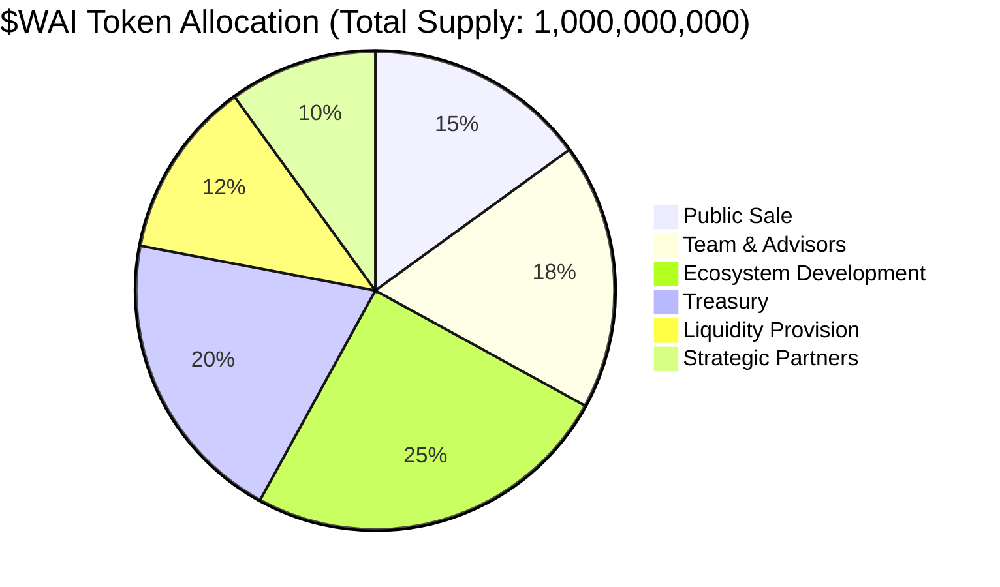
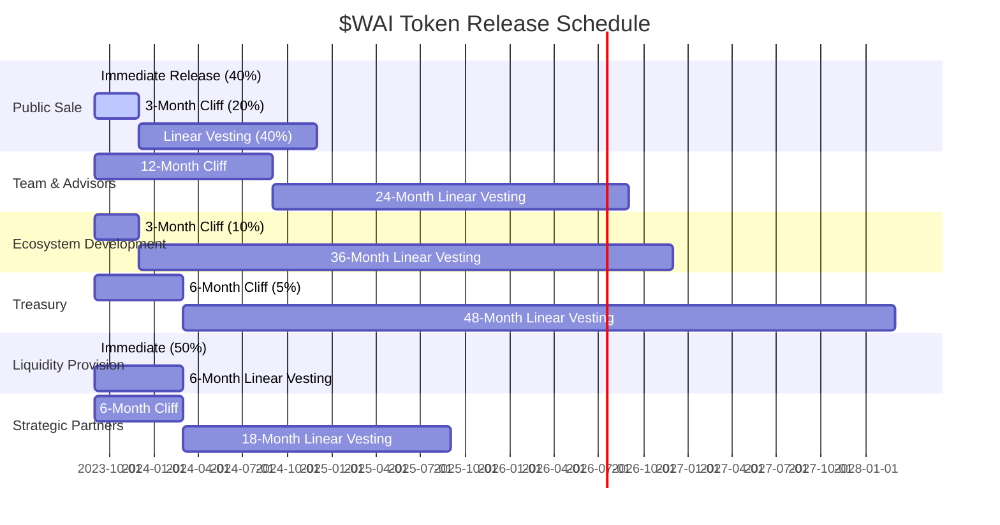
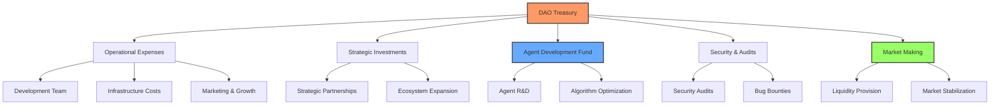
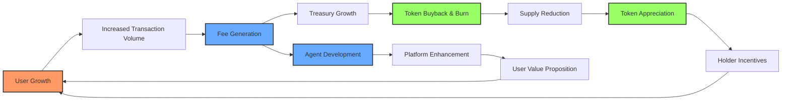

# 💎 Tokenomics & Economic Model

## 🔄 **The $WAI Token Ecosystem**

The Web AI token ($WAI) functions as the cornerstone of our ecosystem, designed with a deflationary mechanism that aligns incentives between users, developers, and investors for long-term sustainable growth.

> *"The $WAI token isn't just a utility token—it's the economic foundation of a self-sustaining ecosystem that rewards participants while continuously enhancing platform capabilities through automated reinvestment mechanisms."*

## 📊 **Token Distribution & Allocation**

The $WAI token has been distributed through a meticulously designed allocation model that ensures balanced incentives and long-term viability:

## 🔐 **Token Vesting & Release Schedule**

To ensure market stability and prevent supply shocks, token unlocks follow a strategic vesting schedule:

## 🔥 **Deflationary Mechanisms & Value Accrual**

The $WAI token incorporates multiple value-accrual mechanisms to ensure continuous price appreciation and ecosystem sustainability:

| **Mechanism** | **Implementation** | **Economic Impact** |
| ------------- | ------------------ | ------------------- |
| Transaction Fee Burn | 1.5% of all transactions | Continuous supply reduction |
| Protocol Revenue Buyback | 40% of platform fees | Market price support |
| Staking Rewards | 5-15% APY with time-locks | Supply velocity reduction |
| Governance Staking | Quadratic voting power | Long-term holder alignment |
| Dynamic Supply Adjustment | Algorithm-driven buybacks | Counter-cyclical stability |

## 🏦 **Decentralized Treasury Management**

The Web AI DAO treasury is governed by a sophisticated multi-signature framework with time-locked execution:

## 💹 **Staking & Governance**

$WAI token holders can participate in the platform's governance and earn rewards through a tiered staking mechanism:

| **Staking Tier** | **Lock Period** | **APY Range** | **Governance Power** | **Agent Access** |
| ---------------- | --------------- | ------------- | -------------------- | --------------- |
| Bronze | 30 days | 5-7% | 1x | Basic Agents |
| Silver | 90 days | 8-10% | 1.5x | + Advanced Agents |
| Gold | 180 days | 11-13% | 2x | + Premium Agents |
| Diamond | 365 days | 14-16% | 3x | All Agents + Beta Features |

## 🛒 **Utility & Platform Integration**

The $WAI token is deeply integrated into all platform functions, creating a robust demand framework:

- **Agent Access**: Token-gated access to premium AI Agents
- **Fee Discounts**: Up to 70% transaction fee discounts for token holders
- **Priority Execution**: Transaction priority based on staking level
- **Data Access**: Premium market data and analytics
- **Agent Customization**: Ability to customize and train personal AI Agents
- **Governance Participation**: Proposal submission and voting rights
- **Revenue Sharing**: Protocol revenue distribution to stakers

## 📈 **Economic Sustainability Model**

## 🔮 **Future Economic Developments**

The Web AI economic model is designed to evolve with market conditions and platform growth:

- **Cross-Chain Expansion**: Bridging to additional L1/L2 ecosystems
- **Synthetic Liquidity Pools**: Advanced DeFi integration for enhanced capital efficiency
- **NFT Integration**: Non-fungible token representation of Agent ownership and customization
- **DAO-as-a-Service**: Governance tooling for institutional participants
- **Oracle Network**: Decentralized price feeds and market intelligence network
- **zkProofs for Privacy**: Zero-knowledge transaction execution for institutional clients

The $WAI token economy establishes a self-reinforcing cycle that rewards all ecosystem participants while ensuring continuous platform evolution and market expansion.
