# Security Agent

The **Security Agent** is our all-seeing, all-knowing sentinel, tirelessly scanning the blockchain for any hint of malicious intent. It ensures that **honeypots, rug pulls, or exploit attempts** don’t stand a chance against your precious crypto assets.  

Think of it like an **AI watchdog hopped up on espresso**: it sniffs out and flags suspicious activity on **newly deployed contracts, monitors wallet movements, detects liquidity shifts**, and **screams at you** the moment something fishy happens.  

This unstoppable sentinel **doesn't just watch passively** — oh no, it **actively cross-checks suspicious behavior** against a vast library of **historical attack vectors** (compiled from thousands of known hacks and exploits). And it does all this at **breakneck speed**, giving you enough time to spare your funds before some unscrupulous punter drains your wallet.

---

## **Key Features**

### **Real-time Smart Contract Scanning**  
- **New Deployments**: The moment a **new contract** hits the blockchain, our Security Agent **scans the code**, hunts for vulnerabilities, and identifies hidden backdoors (if they exist).  
- **AI-Powered Audits**: Harnessing **cutting-edge NLP and code analysis algorithms**, it can detect contract patterns that typically scream **“Scam!”** — you know, the *“holy-crap-my-funds-are-gone”* type.

### **Liquidity & Wallet Movement Monitoring**  
- **Liquidity Shifts**: Security Agent **keeps a hawk’s eye** on the slightest changes in **liquidity pools**, ensuring you’re the first to know if that liquidity is about to take an **unexpected vacation to the Bahamas**.  
- **Wallet Tracking**: The agent **tags suspicious wallets** (e.g., known scammers or newly minted hotshots) and **sets off alarm bells** the moment they try to interact with your beloved tokens.

### **On-chain Forensics & Historical Pattern Recognition**  
- **Attack Database**: With an ever-evolving **knowledge base of past exploits** and shady behavior, the Security Agent compares each new threat to known patterns. If a **brand-new scheme** emerges, it learns from that too.  
- **Forensic Analysis**: Employs **cutting-edge machine learning** to **trace transactions across multiple wallets and protocols** — shining a spotlight on anything that might lead to a **compromised contract or shady developer**.

### **Instant Alerts & Damage Prevention**  
- **Early Warning System**: You’ll get an **immediate** (and we mean **immediate**) notification when something suspicious is detected.  
- **Preemptive Damage Control**: Because the **Security Agent identifies threats in real-time**, you have the **precious window** you need to **pull your funds** or abort a **questionable investment** before you get burnt.

---

## **How It Works Under the Hood**
To keep everything transparent (and **keep your hamster heart from exploding**), here’s a **quick look at our secret sauce**:

### **Blockchain Data Aggregation**  
- The Security Agent **interfaces with nodes** (e.g., Ethereum, BNB Chain, Polygon) to **continuously ingest new blocks and transactions**.  
- We also **tap into indexing services** like **The Graph and Covalent** to retrieve **historical and real-time transaction data at scale**.

### **Smart Contract Analysis Pipeline**  
- Our AI engine **dissects each newly deployed contract** using **advanced parsing and pattern matching**.  
- We **cross-reference anything suspicious** with **public APIs** from big players like **Etherscan and Polygonscan**, pulling down **contract ABI, source code, and developer info** for **cross-verification**.

### **Machine Learning & Attack Database**  
- We feed the Security Agent a **steady diet** of **known exploit signatures, malicious wallet addresses, and transaction patterns** from **top-tier forensic APIs** (like **Chainalysis and Elliptic**).  
- The agent **uses this knowledge** to train **specialized neural networks**, forming a **dynamic detection engine** that identifies **threats with near-zero latency**.

```mermaid
sequenceDiagram
    participant User
    participant SecurityAgent
    participant Blockchain
    participant AttackDB

    User->>SecurityAgent: Monitor my investments
    SecurityAgent->>Blockchain: Track Liquidity & Wallets
    Blockchain-->>SecurityAgent: Returns real-time transaction data
    SecurityAgent->>AttackDB: Compare with past attack patterns
    AttackDB-->>SecurityAgent: Found suspicious activity
    SecurityAgent->>User: 🚨 Alert! Possible Rug Pull 🚨
    User->>Blockchain: Withdraw funds immediately
```

### **Customizable Alert System**  
- Users can **fine-tune thresholds** for **“sketchiness levels”** based on the agent’s **security confidence scores**.  
- Alerts can be pushed to **Telegram, Discord, email**, or your damn **toaster** if that floats your boat.  

### **Preventive Action Commands**  
- For the truly paranoid, the agent can **integrate with your wallet management system** (via **Web3 frameworks like web3.js or ethers.js**) and **auto-reject suspicious transactions** before they even hit the chain.  
- This **optional extra layer** is like having a **personal bodyguard** for your crypto, ready to **kung-fu chop** malicious attempts **in real-time**.

---

## **Use Cases That’ll Make You Drool**

### **DeFi Degens**  
Ape into that **fresh yield farm** without losing your entire **stablecoin stack** to a **rug pull**.  
The **Security Agent** gives you the **green light** or **slaps your hand away** before you jump into a scam pool.

### **NFT Enthusiasts**  
Planning to **mint that brand-new “ArtsyFartsyApes” collection**?  
The **agent scans the contract** and developers’ history, **raising a red flag** if it looks like a quick rug.

### **Token Launchpads**  
Integrate the **Security Agent** into your **launchpad platform** to give your community **instant confidence**.  
Projects are **auto-scanned**, ensuring **only legit tokens** see the light of day.

### **Crypto Exchanges & Marketplaces**  
Any **newly listed token** or **pool** is run through the **AI wringer**, so your users don’t accidentally buy into a **honeypot**.

### **Wallet Providers & Asset Managers**  
Provide an **additional layer of oh-so-sexy security** for your customers by **weaving our agent’s risk detection directly into your user interface**.

---

## **Roadmap & Future Plans**

### **Multi-Chain Mastery**  
We’re adding **more chains** to the watchlist so you can **invest in every corner of the cryptoverse**.

### **Predictive Threat Analysis**  
Soon, we’ll roll out a **threat forecasting system** that will **pinpoint potential exploiters** before they even **finalize their next shady plan** (*puke rainbow-level insane, right?*).

### **Security Gamification**  
Earn **tokens or NFTs** by **actively reporting suspicious addresses and behaviors** that the AI might not have caught.  
Because who **doesn’t love a good reward system**?
